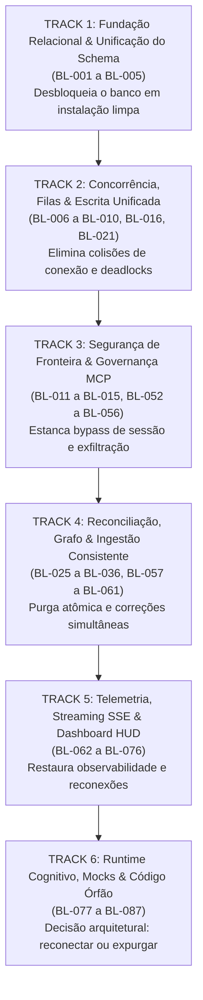
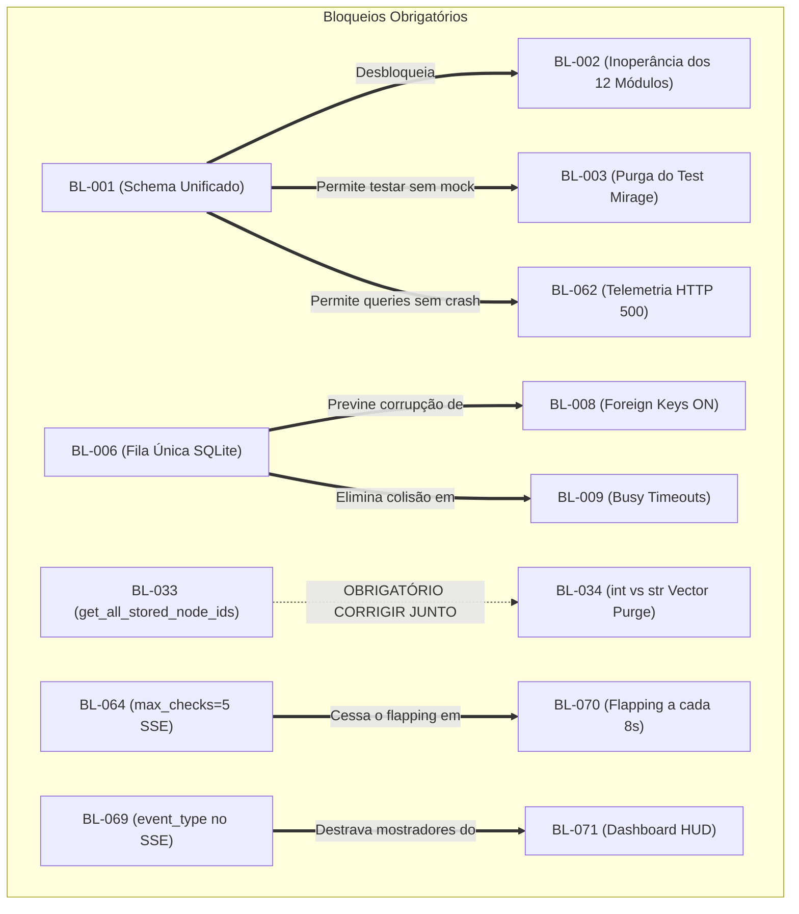

# Backlog Final & Roadmap de Engenharia — Grafo Concierge

> **Fase:** 3 — Consolidação (`backlog-final`)  
> **Data:** 2026-10-01  
> **Fontes:** 15 relatórios de auditoria em `audits/*.md` (Fase 1) + [`audits/cruzamento-modulos.md`](file:///c:/Nexus-Memory/GrafoConcierge/audits/cruzamento-modulos.md) (Fase 2)  
> **Total de Achados Auditados e Catalogados:** 87 itens catalogados (86 achados de não-conformidade confirmados + 1 observação arquitetural de precisão) — 3 Máxima + 21 Crítica + 30 Grave + 28 Média + 5 Baixa  
> **Status:** Concluído — Revisão Exaustiva e Reconciliação Canônica

---

## 1. Diagnóstico e Reconciliação Estrutural da Consolidação da Fase 3

A inspeção detalhada do backlog preliminar consolidado revelou **5 pontos de reconciliação estrutural** necessários para garantir a fidelidade aos relatórios de auditoria da Fase 1 e fornecer um roadmap executável para a engenharia:

1. **Lacunas de Cobertura Identificadas na Fase Preliminar:** Itens confirmados na Fase 1 que não haviam sido transpostos:
   - `agent-and-agents.md` #6: Incompatibilidade estrutural universal com corrotinas assíncronas e bypass do `RateGovernor` em `execute_tool`.
   - `agent-and-agents.md` #7: Dessincronização estrutural entre sub-estados do HSM e `TOOL_DISCLOSURE_MATRIX` (regras mortas).
   - `core-delta-manager.md` #4: TypeError quando `files.content` é NULL (severidade BAIXA no relatório de origem).
   - `mock-vs-real-audit.md` #3: Contrato fantasma de cliente MCP federado em `core/federated_knowledge_router.py:73` (`query_docs` sem implementação real no repositório).
   - `schema-oficial-incompleto.md` #2: O colapso operacional dos 12 subsistemas analíticos foi integrado e documentado formalmente.
2. **Correção de Referências Cruzadas e Citações de Origem:**
   - Em `storage.md`: Alinhamento das referências de `init_fsm_checkpoints_schema` (#4) e `RuntimeError` no reinício da fila (#3).
   - Em `core-delta-manager.md`: Alinhamento do Achado #6 (cegueira LBH em non-Python).
   - Em `schema-oficial-incompleto.md`: Alinhamento do Achado #5 (abandono de especificação formal).
   - Em `interface-telemetry-api.md`: Alinhamento do Achado #2.
3. **Harmonização de Severidades com os Relatórios Canônicos:**
   - Restauração das classificações formais definidas nos relatórios da Fase 1 (ex.: `core-security-guard.md` #2 mantido em ALTA e `core-delta-manager.md` #6 mantido em ALTA/GRAVE).
4. **Elevação da Densidade Técnica e Critérios de Validação:**
   - Expansão de todos os itens com arquivos e números exatos de linha, mecanismo de falha, diretriz de remediação arquitetural e critérios objetivos de validação e teste.
5. **Estruturação por Trilhas de Implementação (Work Packages):**
   - Organização do backlog em 6 Tracks ordenadas por dependência de software real, viabilizando execução paralela e segura por equipes de engenharia.

Esta versão consolidada da **Fase 3** estabelece o **Roadmap de Engenharia e Backlog Executivo Completo**, com rastreabilidade 100% canônica com os 15 relatórios de auditoria, totalizando 87 itens técnicos estruturados (86 achados de não-conformidade confirmados + 1 observação de precisão arquitetural catalogada como melhoria técnica).

### 1.1 Reconciliação com a Fase 2 (79 → 84 → 87)

O relatório da Fase 2 ([`audits/cruzamento-modulos.md`](file:///c:/Nexus-Memory/GrafoConcierge/audits/cruzamento-modulos.md)) e a primeira versão deste backlog (commit `1535c79`) declaravam **79 achados**. A ponte até os **87 itens** atuais foi reconstruída pelo script versionado [`scratch/bridge_79_87.py`](file:///c:/Nexus-Memory/GrafoConcierge/scratch/bridge_79_87.py), que lê este arquivo via `git show` nas versões `1535c79` (79), `503aa6f` (84) e `HEAD` (87) e casa os itens **por achado** (relatório, #), não pelo ID BL, porque a numeração BL mudou entre as versões.

**Citações corrigidas da versão de 79.** Seis linhas da versão de 79 citavam o achado errado (item 2 desta Seção, mais o caso do Test Mirage). Esses achados **já existiam** na versão de 79; não são inclusões. O script aplica a citação correta antes de casar:

| ID na versão 79 | Citação original (errada) | Achado correto | ID atual | Severidade 79 → 87 |
|---|---|---|---|---|
| BL-002 | `schema-oficial-incompleto.md` #2 | `schema-oficial-incompleto.md` #4 (Test Mirage) | BL-003 | Máxima → Crítica |
| BL-018 | `interface-telemetry-api.md` #1 | `interface-telemetry-api.md` #2 | BL-063 | Crítica → Crítica |
| BL-036 | `storage.md` #3 | `storage.md` #4 | BL-019 | Grave → Grave |
| BL-061 | `core-delta-manager.md` #4 | `core-delta-manager.md` #6 | BL-058 | Média → Grave |
| BL-063 | `storage.md` #4 | `storage.md` #3 | BL-021 | Média → Média |
| BL-076 | `schema-oficial-incompleto.md` #4 | `schema-oficial-incompleto.md` #5 | BL-005 | Média → Média |

**Etapa 1 — 79 → 84 (commit `503aa6f`).**
- **5 achados adicionados** (as 5 lacunas do item 1 desta Seção): `agent-and-agents.md` #6 (BL-082, Média), `agent-and-agents.md` #7 (BL-083, Média), `core-delta-manager.md` #4 (BL-060, Média nesta etapa), `mock-vs-real-audit.md` #3 (BL-084, Grave) e `schema-oficial-incompleto.md` #2 (BL-002, Máxima).
- **3 mudanças de severidade**, todas para a severidade do relatório de origem (o item 3 desta Seção cita as duas últimas como exemplo): `schema-oficial-incompleto.md` #4 Máxima → Crítica (BL-003); `core-security-guard.md` #2 Média → Grave (BL-053); `core-delta-manager.md` #6 Média → Grave (BL-058).
- Nenhum achado removido.

**Etapa 2 — 84 → 87 (commits `3b11de7` / `6cac9e7`).**
- **3 achados adicionados:** `mock-vs-real-audit.md` #5 (BL-085, Média), #6 (BL-086, Média) e #7 (BL-087, Baixa).
- **1 mudança de severidade:** `core-delta-manager.md` #4 Média → Baixa (BL-060), alinhando à severidade do relatório de origem.
- Nenhum achado removido.

**Tabela da ponte** (cada linha: valor anterior + adições + mudanças de severidade = valor seguinte):

| Severidade | 79 | Adições 79→84 | Mudanças 79→84 | 84 | Adições 84→87 | Mudanças 84→87 | 87 | Saldo 79→87 |
|---|:---:|---|---|:---:|---|---|:---:|:---:|
| Máxima | 3 | +1 (schema #2) | −1 (schema #4) | 3 | 0 | 0 | 3 | 0 |
| Crítica | 20 | 0 | +1 (schema #4) | 21 | 0 | 0 | 21 | +1 |
| Grave | 27 | +1 (mock #3) | +2 (security-guard #2, delta #6) | 30 | 0 | 0 | 30 | +3 |
| Média | 26 | +3 (agent #6, agent #7, delta #4) | −2 (security-guard #2, delta #6) | 27 | +2 (mock #5, mock #6) | −1 (delta #4) | 28 | +2 |
| Baixa | 3 | 0 | 0 | 3 | +1 (mock #7) | +1 (delta #4) | 5 | +2 |
| **Total** | **79** | **+5** | **0** | **84** | **+3** | **0** | **87** | **+8** |

Conferência por linha: Máxima 3+1−1=3; Crítica 20+0+1=21; Grave 27+1+2=30; Média 26+3−2=27 e 27+2−1=28; Baixa 3+0+0=3 e 3+1+1=5; Total 79+5=84 e 84+3=87.

---

## 2. Visão Executiva e Métricas Consolidadas

```
┌─────────────────────────────────────────────────────────────────────────────┐
│                 BACKLOG FINAL & ROADMAP — 87 ITENS CATALOGADOS              │
│                                                                             │
│  🔴🔴 MÁXIMA   ███                                                3  ( 3.4%)│
│  🔴   CRÍTICA  █████████████████████                             21  (24.1%)│
│  🟠   GRAVE    ██████████████████████████████                    30  (34.5%)│
│  🟡   MÉDIA    ████████████████████████████                      28  (32.2%)│
│  🔵   BAIXA    █████                                              5  ( 5.7%)│
│                                                                             │
│  TOTAL DE ITENS NO ROADMAP: 87 (86 achados + 1 observação)                  │
│  CRÍTICOS + GRAVES (RISCO ALTO/BLOQUEANTE): 54 achados (62.1%)              │
│  SUBSISTEMAS AFETADOS: 15 componentes auditados                             │
│  CADEIAS DE FALHA TRANSVERSAL ATIVAS: 4 cadeias completas                   │
│  CÓDIGO MORTO / ÓRFÃO CONFIRMADO: 6 componentes                             │
│  TEST MIRAGE: 14 suítes mascarando bugs reais de produção                   │
└─────────────────────────────────────────────────────────────────────────────┘
```

### Mapa de Calor Canônico por Subsistema (87 Achados)

| Subsistema / Módulo de Produção | Máxima | Crítica | Grave | Média | Baixa | Total |
|---|---|---|---|---|---|---|
| **Schema & Bootstrapping (`storage/schema.py`, `storage/store.py`)** | 2 | 1 | 1 | 1 | — | **5** |
| **Camada de Escrita & Filas (`core/database.py`, `interface/queue_writer.py`)** | — | 2 | 2 | 1 | — | **5** |
| **Governança & Servidor FastMCP (`interface/mcp_server.py`, `core/mcp_governor.py`)** | 1 | 1 | 2 | 1 | — | **5** |
| **Persistência Relacional e Vetorial (`storage/`)** | — | 2 | 3 | 3 | 1 | **9** |
| **Pipeline de Ingestão (`ingestion/`)** | — | 2 | 2 | 4 | — | **8** |
| **Reconciliação Vetorial (`core/vector_reconciler.py`)** | — | 2 | 1 | 1 | — | **4** |
| **Checkpointer & Viagem no Tempo (`core/checkpointer.py`)** | — | 1 | 2 | 2 | — | **5** |
| **Faxineiro de Background & Pruning (`core/background_janitor.py`)** | — | — | 3 | 2 | — | **5** |
| **Rate Governor & Controle de Tráfego (`core/rate_governor.py`)** | — | 1 | 3 | 1 | — | **5** |
| **Security Guard & Hazard Classifier (`core/security_guard.py`)** | — | 1 | 1 | 2 | 1 | **5** |
| **Delta Manager & AST Sync (`core/delta_manager.py`)** | — | 1 | 1 | 1 | 2 | **5** |
| **API REST & Streaming SSE (`interface/telemetry_api.py`)** | — | 2 | 3 | 2 | — | **7** |
| **Dashboard Web Next.js 16 (`grafo-dashboard-web/`)** | — | 3 | 2 | 3 | — | **8** |
| **Runtime Cognitivo & Agentes (`agent/`, `agents/` — Condicional/Órfão)** | — | 2* | 3* | 2* | — | **7*** |
| **Contratos Fantasma & Divergência de Mocks (`mock-vs-real-audit.md` e `core/federated_knowledge_router.py`)** | — | — | 1 | 2 | 1 | **4** |
| **TOTAL GERAL RECONCILIADO** | **3** | **21** | **30** | **28** | **5** | **87** |

> \* *Severidade Condicional: Código atualmente órfão/desconectado do servidor FastMCP em produção. Seus bugs se materializam no momento em que o código for reconectado.*

---

## 3. O Roteiro de Execução de Engenharia (As 6 Tracks Estruturadas)

A remediação do Grafo Concierge não pode ser executada aleatoriamente. Corrigir certos módulos antes de outros provoca catástrofes de dados (exemplo: corrigir o método fantasma do reconciliador vetorial antes de corrigir a colisão de tipos `int` vs `str` faz o sistema purgar 100% dos vetores legítimos da base).

A ordem mandatória de execução está estruturada em **6 Tracks Sequenciais**:



---

## 4. Backlog Detalhado e Acionável de Engenharia

---

### TRACK 1: Fundação Relacional & Unificação do Schema

> [!CAUTION]
> **BLOQUEANTE SUPREMO DO PROJETO:** Qualquer instalação nova (`git clone`) falha catastroficamente sem esta track. As 5 tabelas críticas devem existir em produção e os testes devem parar de forjar tabelas em `setUp()`.

#### [BL-001] Omissão Estrutural de 5 Tabelas no Bootstrap Oficial de Produção
- **Severidade:** 🔴🔴 PRIORIDADE MÁXIMA
- **Arquivos & Linhas:** [`storage/schema.py:51–144, 285–305`](file:///c:/Nexus-Memory/GrafoConcierge/storage/schema.py#L51), [`storage/store.py:91–107`](file:///c:/Nexus-Memory/GrafoConcierge/storage/store.py#L91), [`core/database.py:32–41`](file:///c:/Nexus-Memory/GrafoConcierge/core/database.py#L32)
- **Relatório de Origem:** [`audits/schema-oficial-incompleto.md`](file:///c:/Nexus-Memory/GrafoConcierge/audits/schema-oficial-incompleto.md) #1 | Eixo Central §1.2
- **Mecanismo da Falha:** `storage/schema.py::SchemaManager.apply_full_schema()` define apenas 8 tabelas legadas (`projects`, `nodes`, `edges`, etc.). Nenhuma instrução DDL de produção cria `files`, `communities`, `ast_edges`, `agent_checkpoints` e `fsm_checkpoints`. `ConciergeDatabaseManager._init_tables()` cria apenas a tabela temporária `test_log`.
- **Diretriz de Remediação:** Integrar formalmente as 5 DDLs completas em `storage/schema.py::TABLES_SQL` e unificar a execução em `SchemaManager.apply_full_schema()`. Adicionar índices adequados para `files.path`, `communities.community_id` e `fsm_checkpoints.session_id`.
- **Critério de Validação:** Apagar `data/concierge.db`, rodar `python -c "from storage import SqliteStore; SqliteStore('data/concierge.db')"` e verificar via script `sqlite3` que `SELECT count(*) FROM sqlite_master WHERE type='table'` retorna as 13 tabelas completas.

#### [BL-002] Inoperância Funcional de 12 Subsistemas Analíticos em Instalação Limpa
- **Severidade:** 🔴🔴 PRIORIDADE MÁXIMA
- **Arquivos & Linhas:** 12 arquivos de `core/*` e `interface/*` (ex: [`core/delta_manager.py:204`](file:///c:/Nexus-Memory/GrafoConcierge/core/delta_manager.py#L204), [`core/vector_reconciler.py:54`](file:///c:/Nexus-Memory/GrafoConcierge/core/vector_reconciler.py#L54), [`core/checkpointer.py:100`](file:///c:/Nexus-Memory/GrafoConcierge/core/checkpointer.py#L100))
- **Relatório de Origem:** [`audits/schema-oficial-incompleto.md`](file:///c:/Nexus-Memory/GrafoConcierge/audits/schema-oficial-incompleto.md) #2 | Eixo Central §1.2
- **Mecanismo da Falha:** Após o boot oficial, invocar `reconcile_orphans()`, `process_file_change()`, `run_idle_summarization()`, `get_telemetry_snapshot()` ou ferramentas MCP de checkpoints explode com `sqlite3.OperationalError: no such table: files/communities/agent_checkpoints`.
- **Diretriz de Remediação:** Desbloqueado diretamente pela resolução do BL-001. Garantir que nenhum módulo de `core/` tente realizar queries em tabelas sem antes verificar ou confiar na integridade do boot do `SchemaManager`.
- **Critério de Validação:** Execução sem erros de um script E2E que instancia sucessivamente `DeltaManager`, `VectorReconciler`, `BackgroundJanitor` e `AgnosticCheckpointer` contra um banco inicializado de forma limpa.

#### [BL-003] Padrão Test Mirage: 14 Suítes de Teste Criam Tabelas Privadas em `setUp()`
- **Severidade:** 🔴 CRÍTICA
- **Arquivos & Linhas:** 14 suítes de teste em [`tests/`](file:///c:/Nexus-Memory/GrafoConcierge/tests) (incluindo `test_delta_sync.py:28`, `test_vector_reconciler.py:35`, `test_telemetry_api.py:38`, `test_checkpoint_pruning.py:22`)
- **Relatório de Origem:** [`audits/schema-oficial-incompleto.md`](file:///c:/Nexus-Memory/GrafoConcierge/audits/schema-oficial-incompleto.md) #4 | Eixo Central §1.2
- **Mecanismo da Falha:** Testes automatizados mascaram a ausência do schema de produção injetando `CREATE TABLE IF NOT EXISTS` em seus métodos de fixture `setUp()`. As suítes passavam com 100% de sucesso testando uma aplicação imaginária.
- **Diretriz de Remediação:** Purgar todas as instruções SQL de `CREATE TABLE` dos métodos `setUp()` das 14 suítes de teste. Configurar as fixtures de teste para inicializarem o banco exclusivamente chamando a API oficial `SqliteStore(db_path)` ou `SchemaManager(conn).apply_full_schema()`.
- **Critério de Validação:** Executar `pytest tests/` e garantir que todos os testes passem sem conter nenhuma linha de DDL hardcoded nas suítes de teste.

#### [BL-004] Mascaramento de Erros DDL e Falsa Confirmação de Integridade no Boot
- **Severidade:** 🟠 GRAVE
- **Arquivos & Linhas:** [`storage/store.py:107`](file:///c:/Nexus-Memory/GrafoConcierge/storage/store.py#L107), [`storage/schema.py:285–305`](file:///c:/Nexus-Memory/GrafoConcierge/storage/schema.py#L285), [`core/database.py:66–67`](file:///c:/Nexus-Memory/GrafoConcierge/core/database.py#L66), [`interface/watcher.py:93–100`](file:///c:/Nexus-Memory/GrafoConcierge/interface/watcher.py#L93)
- **Relatório de Origem:** [`audits/schema-oficial-incompleto.md`](file:///c:/Nexus-Memory/GrafoConcierge/audits/schema-oficial-incompleto.md) #3 | Eixo Central §1.2
- **Mecanismo da Falha:** `core/database.py::execute_write` engole exceções retornando `(False, error)`. `storage/store.py:107` loga `"Schema v3.8.0 verified - all tables and triggers OK"` porque `verify_tables_exist()` valida apenas o subset restrito legado, enganando o operador enquanto 5 tabelas críticas inexistem.
- **Diretriz de Remediação:** Atualizar `verify_tables_exist()` para validar as 13 tabelas obrigatórias. Se qualquer tabela faltar, lançar `RuntimeError` impeditivo no boot em vez de logar confirmação enganosa.
- **Critério de Validação:** Simular ausência da tabela `fsm_checkpoints` e verificar que `store._boot_schema()` levanta exceção fatal e recusa o boot.

#### [BL-005] Abandono da Especificação Arquitetural Formal (`01_ARCHITECTURE.md`)
- **Severidade:** 🟡 MÉDIA
- **Arquivos & Linhas:** [`docs-grafo-concierge/01_ARCHITECTURE.md:130–169`](file:///c:/Nexus-Memory/GrafoConcierge/docs-grafo-concierge/01_ARCHITECTURE.md#L130), [`storage/schema.py:51–144`](file:///c:/Nexus-Memory/GrafoConcierge/storage/schema.py#L51)
- **Relatório de Origem:** [`audits/schema-oficial-incompleto.md`](file:///c:/Nexus-Memory/GrafoConcierge/audits/schema-oficial-incompleto.md) #5 | Eixo Central §1.2
- **Mecanismo da Falha:** O SDD e a documentação prescreviam 13 tabelas divididas entre Survival/Delta Engine e Cognitive Graph. O código implementou apenas 8 tabelas sem documentar desvios ou migrações.
- **Diretriz de Remediação:** Atualizar `01_ARCHITECTURE.md` para alinhar os tipos de dados e nomes canônicos das 13 tabelas finais e referenciar `storage/schema.py` como fonte canônica única da verdade.
- **Critério de Validação:** Documentação e código 100% alinhados na contagem, nomes de colunas e constraints das 13 tabelas.

---

### TRACK 2: Concorrência, Filas & Escrita Unificada SQLite

> [!WARNING]
> **ESTABILIDADE DO BANCO:** Elimina conflitos entre conexões efêmeras cruas de `core/` e a fila de `storage/`, unificando a camada de persistência sob o mesmo pool serializado.

#### [BL-006] Colisão Estrutural entre Fila Real (`storage/`) e Zero Fila (`core/`) sobre o Banco
- **Severidade:** 🔴 CRÍTICA
- **Arquivos & Linhas:** [`storage/connection.py:59`](file:///c:/Nexus-Memory/GrafoConcierge/storage/connection.py#L59), [`core/database.py:56–70`](file:///c:/Nexus-Memory/GrafoConcierge/core/database.py#L56), [`interface/mcp_server.py:166`](file:///c:/Nexus-Memory/GrafoConcierge/interface/mcp_server.py#L166)
- **Relatório de Origem:** [`audits/duplicacao-serialized-write-queue.md`](file:///c:/Nexus-Memory/GrafoConcierge/audits/duplicacao-serialized-write-queue.md) #1 | Eixo Central §1.1
- **Mecanismo da Falha:** `interface/mcp_server.py:166` instancia `ConciergeDatabaseManager` com `write_queue=None`. O `core/` opera sem nenhuma fila, abrindo conexões efêmeras cruas que colidem diretamente contra a worker thread do `SerializedWriteQueue` de `storage/connection.py` sobre `data/concierge.db`.
- **Diretriz de Remediação:** Refatorar `ConciergeDatabaseManager` para ser uma fachada fina que delega 100% de suas leituras e escritas para o `ConnectionManager` de `storage/connection.py`, eliminando conexões `sqlite3.connect()` diretas em `core/`.
- **Critério de Validação:** Executar teste de estresse com 50 threads disparando escritas simultâneas via `ConciergeDatabaseManager` e `SqliteStore` sem nenhum erro `database is locked`.

#### [BL-007] Código Morto em Produção: `interface/queue_writer.py`
- **Severidade:** 🔴 CRÍTICA
- **Arquivos & Linhas:** [`interface/queue_writer.py:32–120`](file:///c:/Nexus-Memory/GrafoConcierge/interface/queue_writer.py#L32), [`interface/mcp_server.py:166`](file:///c:/Nexus-Memory/GrafoConcierge/interface/mcp_server.py#L166)
- **Relatório de Origem:** [`audits/duplicacao-serialized-write-queue.md`](file:///c:/Nexus-Memory/GrafoConcierge/audits/duplicacao-serialized-write-queue.md) #2 | Eixo Central §1.1
- **Mecanismo da Falha:** A classe `SerializedWriteQueue` de `queue_writer.py` é testada em 11 suítes mas jamais é instanciada no servidor MCP de produção. Dá falsa sensação de segurança aos testes enquanto o servidor real roda desprotegido.
- **Diretriz de Remediação:** Descomissionar `interface/queue_writer.py` e migrar todos os testes que a utilizam para testarem `storage/connection.py::SerializedWriteQueue`.
- **Critério de Validação:** Remoção ou substituição de `interface/queue_writer.py` sem regressão nas 11 suítes de teste.

#### [BL-008] Divergência de Integridade Referencial (`foreign_keys=OFF` no core vs `ON` em storage)
- **Severidade:** 🟠 GRAVE
- **Arquivos & Linhas:** [`core/database.py:60`](file:///c:/Nexus-Memory/GrafoConcierge/core/database.py#L60), [`storage/connection.py:155`](file:///c:/Nexus-Memory/GrafoConcierge/storage/connection.py#L155), [`interface/queue_writer.py:49–52`](file:///c:/Nexus-Memory/GrafoConcierge/interface/queue_writer.py#L49)
- **Relatório de Origem:** [`audits/duplicacao-serialized-write-queue.md`](file:///c:/Nexus-Memory/GrafoConcierge/audits/duplicacao-serialized-write-queue.md) #3 | §2.3
- **Mecanismo da Falha:** `storage/connection.py` ativa `PRAGMA foreign_keys=ON;`. Mas `core/database.py` e `queue_writer.py` não ativam foreign keys. O `core/` grava arestas órfãs no banco compartilhado, e quando o `storage/` tenta ler ou manipular, ocorrem corrupções e violações de integridade.
- **Diretriz de Remediação:** Garantir que toda e qualquer conexão SQLite aberta no projeto (unificada pelo `ConnectionManager`) execute imediatamente `PRAGMA foreign_keys=ON;`.
- **Critério de Validação:** Tentar inserir aresta com nó inexistente via `ConciergeDatabaseManager` e validar que o banco lança `sqlite3.IntegrityError`.

#### [BL-009] Timeout Assimétrico de Conexão (5s em storage vs 30s no core)
- **Severidade:** 🟠 GRAVE
- **Arquivos & Linhas:** [`storage/connection.py:154`](file:///c:/Nexus-Memory/GrafoConcierge/storage/connection.py#L154), [`core/database.py:60`](file:///c:/Nexus-Memory/GrafoConcierge/core/database.py#L60)
- **Relatório de Origem:** [`audits/duplicacao-serialized-write-queue.md`](file:///c:/Nexus-Memory/GrafoConcierge/audits/duplicacao-serialized-write-queue.md) #4 | §2.4
- **Mecanismo da Falha:** `storage/connection.py` configura `busy_timeout=5000` (5s), enquanto `core/database.py` usa `timeout=30.0`. Sob contenção pesada mantida por 6 segundos, a camada de storage aborta prematuramente com `OperationalError: database is locked`.
- **Diretriz de Remediação:** Unificar a configuração de timeout para 30 segundos (ou 15 segundos simétricos) em todo o sistema através do `ConnectionManager`.
- **Critério de Validação:** Teste com lock de 6 segundos mantido no banco: camada de storage deve aguardar sem estourar exceção.

#### [BL-010] Quebra de Encapsulamento Privado `_gc._store._conn_mgr._db_path`
- **Severidade:** 🟡 MÉDIA
- **Arquivos & Linhas:** [`interface/mcp_server.py:161–166`](file:///c:/Nexus-Memory/GrafoConcierge/interface/mcp_server.py#L161)
- **Relatório de Origem:** [`audits/duplicacao-serialized-write-queue.md`](file:///c:/Nexus-Memory/GrafoConcierge/audits/duplicacao-serialized-write-queue.md) #5 | §1.1
- **Mecanismo da Falha:** Para criar a segunda conexão desconexa, `mcp_server.py` navega por 3 atributos privados consecutivos.
- **Diretriz de Remediação:** Injetar diretamente a instância de `SqliteStore` ou `ConnectionManager` no container de dependências do servidor.
- **Critério de Validação:** Zero acessos a atributos com `_` prefixado no bootstrap de `mcp_server.py`.

#### [BL-016] Deadlock Inevitável em Escritas Aninhadas/Reentrantes no `SerializedWriteQueue`
- **Severidade:** 🔴 CRÍTICA
- **Arquivos & Linhas:** [`storage/connection.py:111–140`](file:///c:/Nexus-Memory/GrafoConcierge/storage/connection.py#L111)
- **Relatório de Origem:** [`audits/storage.md`](file:///c:/Nexus-Memory/GrafoConcierge/audits/storage.md) #1
- **Mecanismo da Falha:** Se uma operação sendo executada pelo worker da fila de escrita invoca interna ou indiretamente outro método `write()`, ela submete uma nova tarefa na fila e bloqueia em `result_event.wait()`. O worker fica esperando a si mesmo para sempre em Deadlock reentrante.
- **Diretriz de Remediação:** Detectar reentrância (`threading.get_ident() == self._worker_thread_id`). Se a chamada já estiver rodando na thread do worker, executar diretamente o callable em vez de enfileirar.
- **Critério de Validação:** Teste automatizado com escrita aninhada (nível 2) executa e retorna sucesso sem travar a thread.

#### [BL-018] Vazamento Perpétuo de Conexões SQLite em Threads Finalizadas
- **Severidade:** 🟠 GRAVE
- **Arquivos & Linhas:** [`storage/connection.py:257–273`](file:///c:/Nexus-Memory/GrafoConcierge/storage/connection.py#L257)
- **Relatório de Origem:** [`audits/storage.md`](file:///c:/Nexus-Memory/GrafoConcierge/audits/storage.md) #2
- **Mecanismo da Falha:** `ConnectionManager.get_read_connection()` retém referências fortes de todas as conexões criadas na lista `_read_connections`. Quando threads efêmeras morrem, os objetos `sqlite3.Connection` continuam presos, vazando memória WAL e descritores de arquivo.
- **Diretriz de Remediação:** Utilizar `threading.local()` para conexões de leitura ou gerenciar as referências com `weakref`.
- **Critério de Validação:** Criar e finalizar 100 threads com leituras: a contagem de conexões ativas não deve se acumular indefinidamente.

#### [BL-021] Falha ao Reiniciar `SerializedWriteQueue` após `stop()`
- **Severidade:** 🟡 MÉDIA
- **Arquivos & Linhas:** [`storage/connection.py:75–110`](file:///c:/Nexus-Memory/GrafoConcierge/storage/connection.py#L75)
- **Relatório de Origem:** [`audits/storage.md`](file:///c:/Nexus-Memory/GrafoConcierge/audits/storage.md) #3
- **Mecanismo da Falha:** `threading.Thread` não pode ser reiniciada no Python (`RuntimeError`). Se `stop()` e `start()` forem invocados em sequência, o sistema quebra.
- **Diretriz de Remediação:** Em `start()`, se a thread anterior estiver morta, instanciar uma nova `threading.Thread` antes de chamar `.start()`.
- **Critério de Validação:** Chamar `queue.start()`, `queue.stop()`, `queue.start()` com sucesso.

---

### TRACK 3: Segurança de Fronteira, Autenticação e Governança MCP

> [!CAUTION]
> **SEGURANÇA ESTRUTURAL:** Estanca o bypass de privilégios de ferramentas perigosas, protege checkpoints contra envenenamento e previne execução arbitrária de comandos no SO.

#### [BL-011] Bypass Total da Governança de Ferramentas via Injeção de `session_id` Fantasma
- **Severidade:** 🔴🔴 PRIORIDADE MÁXIMA
- **Arquivos & Linhas:** [`interface/mcp_server.py:249–259`](file:///c:/Nexus-Memory/GrafoConcierge/interface/mcp_server.py#L249), [`core/mcp_governor.py:100, 128–193`](file:///c:/Nexus-Memory/GrafoConcierge/core/mcp_governor.py#L100)
- **Relatório de Origem:** [`audits/bypass-governanca-por-session-id.md`](file:///c:/Nexus-Memory/GrafoConcierge/audits/bypass-governanca-por-session-id.md) #1 | Cadeia §6.3
- **Mecanismo da Falha:** `concierge_set_state` é classificada como `READ_ONLY` (sempre aberta). Qualquer agente restrito em `PLANNING` pode criar uma sessão arbitrária `X` em `MAINTENANCE` e invocar ferramentas `DANGEROUS` (ex.: `reset_collection`) injetando `{"session_id": "X"}` no JSON-RPC. O FastMCP valida a sessão `X` e descarta o parâmetro extra antes da execução da ferramenta.
- **Diretriz de Remediação:** Classificar `concierge_set_state` como `ADMIN`/`DANGEROUS`. Vincular a sessão ao transporte MCP real (ou exigir token de autenticação de sessão) em vez de aceitar strings livres do cliente.
- **Critério de Validação:** Agente em `PLANNING` tenta invocar `concierge_set_state` para transicionar sessão arbitrária: chamada deve ser rejeitada com `PermissionError`.

#### [BL-012] Ausência Total de Verificação de Posse em Checkpoints de Agentes
- **Severidade:** 🔴 CRÍTICA
- **Arquivos & Linhas:** [`core/mcp_governor.py:39`](file:///c:/Nexus-Memory/GrafoConcierge/core/mcp_governor.py#L39), [`core/checkpointer.py:138, 226`](file:///c:/Nexus-Memory/GrafoConcierge/core/checkpointer.py#L138), [`interface/mcp_server.py:897–960, 1731`](file:///c:/Nexus-Memory/GrafoConcierge/interface/mcp_server.py#L897)
- **Relatório de Origem:** [`audits/bypass-governanca-por-session-id.md`](file:///c:/Nexus-Memory/GrafoConcierge/audits/bypass-governanca-por-session-id.md) #2 | Cadeia §6.3
- **Mecanismo da Falha:** `agent_get_checkpoint` (`READ_ONLY`) e `agent_save_checkpoint` (`LOCAL_MUTATION`) estão abertas por padrão em `EXECUTION`. Qualquer agente ou cliente pode ler segredos ou sobrescrever/envenenar checkpoints de qualquer outro agente simplesmente fornecendo seu `agent_id`.
- **Diretriz de Remediação:** Implementar amarração estrita de posse baseada em contexto autenticado ou token de agente. Impedir leitura/gravação em namespaces de outros agentes sem autorização explícita de admin.
- **Critério de Validação:** Agente A tenta ler ou sobrescrever checkpoint com `agent_id="agente_b"`: operação deve ser barrada imediatamente com erro de acesso negado.

#### [BL-013] Vazamento de 100% do Catálogo de Ferramentas em `list_tools()`
- **Severidade:** 🟠 GRAVE
- **Arquivos & Linhas:** [`interface/mcp_server.py:261–270`](file:///c:/Nexus-Memory/GrafoConcierge/interface/mcp_server.py#L261)
- **Relatório de Origem:** [`audits/bypass-governanca-por-session-id.md`](file:///c:/Nexus-Memory/GrafoConcierge/audits/bypass-governanca-por-session-id.md) #3 | §3
- **Mecanismo da Falha:** `governed_list_tools` só filtra a lista de ferramentas se `session_id` for enviado. Clientes MCP oficiais padrão nunca enviam `session_id` no handshake `tools/list`, expondo todas as 31 ferramentas (inclusive perigosas) e quebrando o *Progressive Tool Disclosure*.
- **Diretriz de Remediação:** Filtrar ferramentas por padrão de acordo com o estado do servidor/sessão padrão ou ocultar ferramentas `DANGEROUS` da listagem pública até que uma sessão autenticada em `MAINTENANCE` seja estabelecida.
- **Critério de Validação:** Requisição padrão `tools/list` sem parâmetros retorna apenas ferramentas autorizadas para o estado inicial.

#### [BL-014] Desconexão Total do Runtime Cognitivo no Servidor MCP
- **Severidade:** 🟠 GRAVE
- **Arquivos & Linhas:** [`agent/run_agent.py`](file:///c:/Nexus-Memory/GrafoConcierge/agent/run_agent.py), [`core/hsm_engine.py`](file:///c:/Nexus-Memory/GrafoConcierge/core/hsm_engine.py), [`interface/mcp_server.py:1–1786`](file:///c:/Nexus-Memory/GrafoConcierge/interface/mcp_server.py#L1)
- **Relatório de Origem:** [`audits/bypass-governanca-por-session-id.md`](file:///c:/Nexus-Memory/GrafoConcierge/audits/bypass-governanca-por-session-id.md) #4 | §4
- **Mecanismo da Falha:** Toda a infraestrutura complexa de Harel Statecharts (HSM), Deep History Nodes ($H^*$) e Circuit Breaker de sub-estados nunca é instanciada pelo servidor MCP. O "estado" do servidor é uma string solta num dicionário em memória.
- **Diretriz de Remediação:** Decisão arquitetural formal: (1) Acoplar e instanciar oficialmente o HSM no servidor MCP gerenciando as sessões dos agentes; ou (2) Descomissionar formalmente a máquina de estados complexa e simplificar o governor.
- **Critério de Validação:** Alinhamento comprovado entre o modelo documentado no SDD e a execução real no servidor MCP.

#### [BL-015] Inicialização Insegura por Padrão (`default_state = "EXECUTION"`)
- **Severidade:** 🟡 MÉDIA
- **Arquivos & Linhas:** [`core/mcp_governor.py:37–38`](file:///c:/Nexus-Memory/GrafoConcierge/core/mcp_governor.py#L37)
- **Relatório de Origem:** [`audits/bypass-governanca-por-session-id.md`](file:///c:/Nexus-Memory/GrafoConcierge/audits/bypass-governanca-por-session-id.md) #5 | §3
- **Mecanismo da Falha:** O servidor sobe imediatamente em `EXECUTION`, liberando mutações físicas (`LOCAL_MUTATION`) antes mesmo de qualquer planejamento.
- **Diretriz de Remediação:** Alterar o estado padrão do governor para `PLANNING` no boot.
- **Critério de Validação:** Boot do servidor inicializa com `get_state() == "PLANNING"`.

#### [BL-052] Evasão da Blacklist de Comandos Destrutivos do SecurityGuard
- **Severidade:** 🔴 CRÍTICA
- **Arquivos & Linhas:** [`core/security_guard.py:42–45, 94–95`](file:///c:/Nexus-Memory/GrafoConcierge/core/security_guard.py#L42)
- **Relatório de Origem:** [`audits/core-security-guard.md`](file:///c:/Nexus-Memory/GrafoConcierge/audits/core-security-guard.md) #1 | Cadeia §6.4
- **Mecanismo da Falha:** A regex estática `\brm\s+-rf\s+/` é contornada por variações canônicas de flags (`rm -fr /`, `rm -r -f /`), deleção do diretório atual (`rm -rf .`), e comandos destrutivos do Windows (`del /s /q C:\*`, `format C:`). Em modo `auto-approve`, o agente executa esses comandos sem confirmação humana.
- **Diretriz de Remediação:** Fazer parsing léxico/semântico da linha de comando via `shlex.split`, identificando o binário e combinando as flags `-r`/`--recursive` e `-f`/`--force` contra caminhos perigosos (`/`, `.`, `*`, `C:\`). Bloquear comandos destrutivos do Windows (`del /s`, `rd /s`, `format`).
- **Critério de Validação:** Script de teste executa as 9 variantes canônicas de evasão: todas devem ser classificadas como `CRITICAL`.

#### [BL-053] `classify_command(None)` Lança `TypeError` Não Tratado
- **Severidade:** 🟠 GRAVE
- **Arquivos & Linhas:** [`core/security_guard.py:94`](file:///c:/Nexus-Memory/GrafoConcierge/core/security_guard.py#L94)
- **Relatório de Origem:** [`audits/core-security-guard.md`](file:///c:/Nexus-Memory/GrafoConcierge/audits/core-security-guard.md) #2 | Cadeia §6.4
- **Mecanismo da Falha:** Se `command` vier como `None`, o método invoca `self.blacklisted_patterns.search(command)`, explodindo com `TypeError: expected string or bytes-like object, got 'NoneType'` e derrubando a thread de governança.
- **Diretriz de Remediação:** Adicionar guarda inicial `if not command or not isinstance(command, str): return "SAFE"` (ou `"WARNING"`).
- **Critério de Validação:** `guard.classify_command(None)` retorna `"SAFE"` (ou status controlado) sem lançar exceção.

#### [BL-054] Bug de Barra Dupla `C:\\\\` na Raiz Bloqueia 100% dos Arquivos em `is_safe_path`
- **Severidade:** 🟡 MÉDIA
- **Arquivos & Linhas:** [`core/security_guard.py:75–77`](file:///c:/Nexus-Memory/GrafoConcierge/core/security_guard.py#L75)
- **Relatório de Origem:** [`audits/core-security-guard.md`](file:///c:/Nexus-Memory/GrafoConcierge/audits/core-security-guard.md) #3
- **Mecanismo da Falha:** `self.project_root + os.sep`. Se `project_root` for a raiz do disco (`C:\`), já termina com separador. Concatena gerando `C:\\\\`. Como nenhum arquivo começa com barra dupla, `is_safe_path` retorna `False` para 100% dos arquivos válidos.
- **Diretriz de Remediação:** Normalizar caminhos com `os.path.abspath` e `os.path.normpath` em vez de concatenação manual com `os.sep`.
- **Critério de Validação:** `SecurityGuard(project_root="C:\\").is_safe_path("C:\\valid_dir\\file.txt")` retorna `True`.

#### [BL-055] Resolução de Caminhos Relativos Ancorada ao CWD do Processo e Não a `project_root`
- **Severidade:** 🟡 MÉDIA
- **Arquivos & Linhas:** [`core/security_guard.py:72–77`](file:///c:/Nexus-Memory/GrafoConcierge/core/security_guard.py#L72)
- **Relatório de Origem:** [`audits/core-security-guard.md`](file:///c:/Nexus-Memory/GrafoConcierge/audits/core-security-guard.md) #4
- **Mecanismo da Falha:** `os.path.realpath(target_path)` resolve contra o CWD do processo. Se o servidor rodar em outra pasta, caminhos relativos legítimos do projeto são rejeitados incorretamente.
- **Diretriz de Remediação:** Se `target_path` for relativo, resolvê-lo explicitamente via `os.path.join(self.project_root, target_path)` antes do `realpath`.
- **Critério de Validação:** CWD em diretório externo: caminhos relativos ao projeto continuam retornando `is_safe_path == True`.

#### [BL-056] Falsos Positivos de WARNING em Comandos Inofensivos Contendo `"build"`
- **Severidade:** 🔵 BAIXA
- **Arquivos & Linhas:** [`core/security_guard.py:48–54, 98–99`](file:///c:/Nexus-Memory/GrafoConcierge/core/security_guard.py#L48)
- **Relatório de Origem:** [`audits/core-security-guard.md`](file:///c:/Nexus-Memory/GrafoConcierge/audits/core-security-guard.md) #5
- **Mecanismo da Falha:** `any(term in command)`. Comandos como `git log --grep="build"` disparam alerta desnecessário no modo `ask`.
- **Diretriz de Remediação:** Usar correspondência com limites de palavra (`\bbuild\b`) ou analisar os argumentos do comando.
- **Critério de Validação:** `git log --grep="build"` classificado como `SAFE`.

---

### TRACK 4: Reconciliação, Grafo & Ingestão Consistente

> [!CAUTION]
> **DEPENDÊNCIA CRÍTICA INVIOLÁVEL:** BL-033 e BL-034 **DEVEM** ser corrigidos no mesmo commit. Corrigir apenas BL-033 ativa o bug do BL-034, expurgando 100% dos vetores legítimos da base vetorial.

#### [BL-033] Invocação de Método Fantasma `self.vector_db.get_all_ids()`
- **Severidade:** 🔴 CRÍTICA
- **Arquivos & Linhas:** [`core/vector_reconciler.py:39`](file:///c:/Nexus-Memory/GrafoConcierge/core/vector_reconciler.py#L39), [`storage/base_backend.py:91`](file:///c:/Nexus-Memory/GrafoConcierge/storage/base_backend.py#L91), [`storage/vector_store.py:263`](file:///c:/Nexus-Memory/GrafoConcierge/storage/vector_store.py#L263)
- **Relatório de Origem:** [`audits/core-vector-reconciler.md`](file:///c:/Nexus-Memory/GrafoConcierge/audits/core-vector-reconciler.md) #1, [`audits/mock-vs-real-audit.md`](file:///c:/Nexus-Memory/GrafoConcierge/audits/mock-vs-real-audit.md) #1 | Cadeia §6.1
- **Mecanismo da Falha:** `vector_reconciler.py:39` chama `get_all_ids()`. Esse método não existe em `BaseVectorBackend` nem em `ChromaVectorStore` (o método real de produção é `get_all_stored_node_ids()`). Em runtime real, explode com `AttributeError`. O bug passou despercebido porque `MockVectorDatabase` inventou esse método.
- **Diretriz de Remediação:** Substituir a chamada por `self.vector_db.get_all_stored_node_ids()`.
- **Critério de Validação:** `VectorReconciler` executa com a classe real `ChromaVectorStore` sem lançar `AttributeError`.

#### [BL-034] Purga Garantida de 100% dos Vetores por Incompatibilidade `int` vs `str`
- **Severidade:** 🔴 CRÍTICA (Perda Catastrófica de Dados)
- **Arquivos & Linhas:** [`core/vector_reconciler.py:40–49, 54`](file:///c:/Nexus-Memory/GrafoConcierge/core/vector_reconciler.py#L40)
- **Relatório de Origem:** [`audits/core-vector-reconciler.md`](file:///c:/Nexus-Memory/GrafoConcierge/audits/core-vector-reconciler.md) #2 | Cadeia §6.1
- **Mecanismo da Falha:** `get_all_stored_node_ids()` retorna `set[int]`. Mas o reconciliador compara isso contra `SELECT path FROM files;` (`set[str]`). Em Python, `set[int] - set[str]` tem interseção nula, fazendo o cálculo de órfãos retornar **100% dos vetores legítimos**, que são deletados fisicamente do banco vetorial.
- **Diretriz de Remediação:** Corrigir a query SQLite para consultar IDs numéricos de nós (`SELECT id FROM nodes;`) e mapear os tipos para inteiro antes da subtração de conjuntos.
- **Critério de Validação:** Reconciliação executada sobre banco sincronizado resulta em 0 vetores deletados.

#### [BL-017] Bypass de Strict Scoping na Busca Vetorial com `project_uuids=[]`
- **Severidade:** 🔴 CRÍTICA (Vazamento Cross-Project)
- **Arquivos & Linhas:** [`storage/vector_store.py:449–458, 711–740`](file:///c:/Nexus-Memory/GrafoConcierge/storage/vector_store.py#L449)
- **Relatório de Origem:** [`audits/storage.md`](file:///c:/Nexus-Memory/GrafoConcierge/audits/storage.md) #6 | §3.1
- **Mecanismo da Falha:** Quando `project_uuids=[]`, nenhum filtro de projeto é aplicado na cláusula `$in` do ChromaDB. A busca retorna vetores e trechos de código de **todos os projetos cadastrados**.
- **Diretriz de Remediação:** Se `project_uuids` for vazio, retornar lista vazia `[]` imediatamente (*Fail-Closed*).
- **Critério de Validação:** Busca vetorial com `project_uuids=[]` retorna `[]` sem consultar a base vetorial.

#### [BL-025] Perda Total no Grafo na Renomeação de Arquivos
- **Severidade:** 🔴 CRÍTICA
- **Arquivos & Linhas:** [`ingestion/crawler.py:560`](file:///c:/Nexus-Memory/GrafoConcierge/ingestion/crawler.py#L560), [`ingestion/orchestrator.py:765`](file:///c:/Nexus-Memory/GrafoConcierge/ingestion/orchestrator.py#L765)
- **Relatório de Origem:** [`audits/ingestion.md`](file:///c:/Nexus-Memory/GrafoConcierge/audits/ingestion.md) #1 | Cadeia §6.1
- **Mecanismo da Falha:** `find_node_by_hash` busca apenas por hash. Ao renomear arquivo sem alterar o conteúdo, o crawler acha que o arquivo é antigo e não reingere os nós; em seguida, o GC purga o caminho antigo, deixando o arquivo com 0 nós no grafo.
- **Diretriz de Remediação:** Associar o caminho relativo na busca por hash e atualizar o caminho do nó no SQLite em vez de purgar no GC.
- **Critério de Validação:** Renomear `a.py` para `b.py` e verificar que os nós persistem no grafo associados ao novo caminho.

#### [BL-026] Descarte Silencioso de 100% dos Resumos L0 com Gravação de `NULL`
- **Severidade:** 🔴 CRÍTICA
- **Arquivos & Linhas:** [`ingestion/orchestrator.py:191, 201, 571, 843`](file:///c:/Nexus-Memory/GrafoConcierge/ingestion/orchestrator.py#L191)
- **Relatório de Origem:** [`audits/ingestion.md`](file:///c:/Nexus-Memory/GrafoConcierge/audits/ingestion.md) #2 | Cadeia §6.2
- **Mecanismo da Falha:** `_step_summarize` chama o LLM mas nunca anexa o resumo aos chunks. No `_step_store_sqlite`, busca `chunk.cached_summary` (que é sempre `None`), gravando `nodes.summary = NULL` e esterilizando a geração de L1 e L2.
- **Diretriz de Remediação:** Associar o retorno de `SummaryResult` ao campo `chunk.cached_summary` antes do envio para persistência no SQLite.
- **Critério de Validação:** Ingestão concluída grava resumos textuais preenchidos na coluna `nodes.summary`.

#### [BL-027] Falha Silenciosa de Persistência do L2 Compass no SQLite
- **Severidade:** 🟠 GRAVE
- **Arquivos & Linhas:** [`ingestion/summarizer.py:789`](file:///c:/Nexus-Memory/GrafoConcierge/ingestion/summarizer.py#L789), [`ingestion/orchestrator.py:880–883`](file:///c:/Nexus-Memory/GrafoConcierge/ingestion/orchestrator.py#L880)
- **Relatório de Origem:** [`audits/ingestion.md`](file:///c:/Nexus-Memory/GrafoConcierge/audits/ingestion.md) #3 | Cadeia §6.2
- **Mecanismo da Falha:** `summarizer.py` envia `folder_name` onde `uuid` é exigido por `update_project(uuid, ...)`. A query afeta 0 linhas sem lançar erro, e o log diz enganosamente que o L2 Compass foi persistido com sucesso.
- **Diretriz de Remediação:** Passar o `project_uuid` canônico em vez de `folder_name` na chamada a `update_project`.
- **Critério de Validação:** `SELECT summary FROM projects WHERE uuid = ?` retorna o resumo L2 Compass.

#### [BL-028] Acúmulo Perpétuo de Vetores Zumbis no ChromaDB
- **Severidade:** 🟠 GRAVE
- **Arquivos & Linhas:** [`ingestion/orchestrator.py:213, 234–239`](file:///c:/Nexus-Memory/GrafoConcierge/ingestion/orchestrator.py#L213)
- **Relatório de Origem:** [`audits/ingestion.md`](file:///c:/Nexus-Memory/GrafoConcierge/audits/ingestion.md) #4 | Cadeia §6.1
- **Mecanismo da Falha:** Modificações de código geram novos vetores, mas como nenhum arquivo foi deletado do disco, `deleted_node_ids` é vazio e o Step 7 de GC é pulado, acumulando vetores antigos no ChromaDB.
- **Diretriz de Remediação:** Passar os IDs dos chunks antigos substituídos no SQLite para o expurgo vetorial do Step 7.
- **Critério de Validação:** Modificar arquivo removendo funções: o ChromaDB não deve acumular vetores mortos.

#### [BL-035] Race Condition Destrutiva TOCTOU no Reconciliador Vetorial
- **Severidade:** 🟠 GRAVE
- **Arquivos & Linhas:** [`core/vector_reconciler.py:31–50`](file:///c:/Nexus-Memory/GrafoConcierge/core/vector_reconciler.py#L31)
- **Relatório de Origem:** [`audits/core-vector-reconciler.md`](file:///c:/Nexus-Memory/GrafoConcierge/audits/core-vector-reconciler.md) #3
- **Mecanismo da Falha:** O reconciliador roda sem lock enquanto a ingestão grava vetores no Step 6 e comita no SQLite no Step 8. Vetores em trânsito são deletados como "órfãos".
- **Diretriz de Remediação:** Implementar lock compartilhado ou janela de carência temporal (só deletar vetores com mais de 5 minutos de criação).
- **Critério de Validação:** Ingestão concorrente com reconciliador ativo não perde vetores recém-criados.

#### [BL-057] Método Fantasma `has_structural_change()` no DeltaManager
- **Severidade:** 🔴 CRÍTICA
- **Arquivos & Linhas:** [`core/delta_manager.py:70`](file:///c:/Nexus-Memory/GrafoConcierge/core/delta_manager.py#L70), [`core/hsm_engine.py:458`](file:///c:/Nexus-Memory/GrafoConcierge/core/hsm_engine.py#L458), [`tests/test_hsm_transition_hooks_and_delta.py:25`](file:///c:/Nexus-Memory/GrafoConcierge/tests/test_hsm_transition_hooks_and_delta.py#L25)
- **Relatório de Origem:** [`audits/core-delta-manager.md`](file:///c:/Nexus-Memory/GrafoConcierge/audits/core-delta-manager.md) #1, [`audits/mock-vs-real-audit.md`](file:///c:/Nexus-Memory/GrafoConcierge/audits/mock-vs-real-audit.md) #2 | §2.2
- **Mecanismo da Falha:** `hsm_engine.py:458` chama método que não existe na classe real de produção. O bug foi mascarado por `MockDeltaManager`.
- **Diretriz de Remediação:** Implementar o método `has_structural_change(task_id)` na classe `DeltaManager` ou alinhar a chamada com `process_file_change`.
- **Critério de Validação:** `hasattr(DeltaManager, 'has_structural_change') == True`.

#### [BL-058] Cegueira de LBH em Non-Python e SSH Incompleto
- **Severidade:** 🟠 GRAVE
- **Arquivos & Linhas:** [`core/delta_manager.py:83–97, 99–116`](file:///c:/Nexus-Memory/GrafoConcierge/core/delta_manager.py#L83), [`tests/test_ssh_language_coverage.py`](file:///c:/Nexus-Memory/GrafoConcierge/tests/test_ssh_language_coverage.py)
- **Relatório de Origem:** [`audits/core-delta-manager.md`](file:///c:/Nexus-Memory/GrafoConcierge/audits/core-delta-manager.md) #6
- **Mecanismo da Falha:** `calculate_lbh()` retorna `""` para todo código TypeScript/JS/outros, e o SSH perde assinaturas aninhadas e interfaces.
- **Diretriz de Remediação:** Expandir o cálculo de LBH e SSH para suportar TS/JS via regex ou parser dedicado.
- **Critério de Validação:** `test_ssh_language_coverage.py` atinge cobertura satisfatória para TS/JS.

#### [BL-020] Falha de Tipo em `_calculate_decay` com Timestamps ISO Offset-Aware
- **Severidade:** 🟠 GRAVE
- **Arquivos & Linhas:** [`storage/logic.py:330–350`](file:///c:/Nexus-Memory/GrafoConcierge/storage/logic.py#L330)
- **Relatório de Origem:** [`audits/storage.md`](file:///c:/Nexus-Memory/GrafoConcierge/audits/storage.md) #5 | §2.1
- **Mecanismo da Falha:** Subtração entre `datetime.utcnow()` (offset-naive) e timestamp ISO com timezone lança `TypeError`, degradando o score de recência para o mínimo `0.01` sempre.
- **Diretriz de Remediação:** Usar `datetime.now(timezone.utc)` de forma consistente em todas as operações temporais.
- **Critério de Validação:** `_calculate_decay` retorna valor próximo de 1.0 para commits recentes.

#### [BL-036] Falta de Paginação em `delete_batch` no Reconciliador Vetorial
- **Severidade:** 🟡 MÉDIA
- **Arquivos & Linhas:** [`core/vector_reconciler.py:48–50`](file:///c:/Nexus-Memory/GrafoConcierge/core/vector_reconciler.py#L48)
- **Relatório de Origem:** [`audits/core-vector-reconciler.md`](file:///c:/Nexus-Memory/GrafoConcierge/audits/core-vector-reconciler.md) #4
- **Mecanismo da Falha:** Passa lista desmedida de uma só vez estourando buffers de rede ou limites de payload.
- **Diretriz de Remediação:** Implementar loop de fatiamento em lotes de 100 itens.
- **Critério de Validação:** Purga de 500 itens despachada em 5 lotes de 100.

#### [BL-029] Crash com `AttributeError` em Ingestão sem Summarizer
- **Severidade:** 🟡 MÉDIA
- **Arquivos & Linhas:** [`ingestion/orchestrator.py:442, 449`](file:///c:/Nexus-Memory/GrafoConcierge/ingestion/orchestrator.py#L442)
- **Relatório de Origem:** [`audits/ingestion.md`](file:///c:/Nexus-Memory/GrafoConcierge/audits/ingestion.md) #5
- **Mecanismo da Falha:** `if regular_chunks:` não valida se `self._summarizer` é `None`.
- **Diretriz de Remediação:** Proteger com `if regular_chunks and self._summarizer:`.
- **Critério de Validação:** Ingestão com `summarizer=None` conclui sem erros no log.

#### [BL-030] Descarte Arbitrário de `requirements.txt` por `*.txt` no Ignore Padrão
- **Severidade:** 🟡 MÉDIA
- **Arquivos & Linhas:** [`ingestion/crawler.py:395, 481`](file:///c:/Nexus-Memory/GrafoConcierge/ingestion/crawler.py#L395)
- **Relatório de Origem:** [`audits/ingestion.md`](file:///c:/Nexus-Memory/GrafoConcierge/audits/ingestion.md) #6
- **Mecanismo da Falha:** `DEFAULT_IGNORE_PATTERNS` contém `*.txt`, impedindo ingestão de arquivos de dependências.
- **Diretriz de Remediação:** Remover `*.txt` dos ignores padrão e preservar apenas arquivos de log e temporários.
- **Critério de Validação:** Crawler cataloga `requirements.txt` com sucesso.

#### [BL-031] Poluição de Tags Semânticas por Substrings Ingênuas
- **Severidade:** 🟡 MÉDIA
- **Arquivos & Linhas:** [`ingestion/parser.py:100–111, 973–975`](file:///c:/Nexus-Memory/GrafoConcierge/ingestion/parser.py#L100)
- **Relatório de Origem:** [`audits/ingestion.md`](file:///c:/Nexus-Memory/GrafoConcierge/audits/ingestion.md) #7
- **Mecanismo da Falha:** `keyword in content_lower` atribui tags `react` e `nextjs` para códigos que usam `reaction` ou `next()`.
- **Diretriz de Remediação:** Usar expressões regulares com limites de palavra (`\bkeyword\b`).
- **Critério de Validação:** Código Python puro não recebe tags frontend.

#### [BL-032] Truncamento de Código JS/TS por Contagem Ingênua de Chaves `{}`
- **Severidade:** 🟡 MÉDIA
- **Arquivos & Linhas:** [`ingestion/parser.py:701–715`](file:///c:/Nexus-Memory/GrafoConcierge/ingestion/parser.py#L701)
- **Relatório de Origem:** [`audits/ingestion.md`](file:///c:/Nexus-Memory/GrafoConcierge/audits/ingestion.md) #8
- **Mecanismo da Falha:** Contagem de chaves em strings ou comentários fecha funções prematuramente.
- **Diretriz de Remediação:** Máquina de estados léxica simples que ignora chaves dentro de aspas ou comentários.
- **Critério de Validação:** Função JS contendo string `"}"` não é truncada.

#### [BL-059] Dupla Conexão Efêmera Crua por Mutação no DeltaManager
- **Severidade:** 🟡 MÉDIA
- **Arquivos & Linhas:** [`core/delta_manager.py:160–200, 204–265`](file:///c:/Nexus-Memory/GrafoConcierge/core/delta_manager.py#L160)
- **Relatório de Origem:** [`audits/core-delta-manager.md`](file:///c:/Nexus-Memory/GrafoConcierge/audits/core-delta-manager.md) #3
- **Mecanismo da Falha:** Executa duas `write_query` separadas em conexões efêmeras sem transação envolvente.
- **Diretriz de Remediação:** Encapsular ambas as queries em uma única transação atômica (`BEGIN IMMEDIATE`).
- **Critério de Validação:** Falha na segunda escrita reverte a primeira.

#### [BL-060] TypeError em `compile_community_summary_jit()` quando `files.content` é NULL
- **Severidade:** 🔵 BAIXA
- **Arquivos & Linhas:** [`core/delta_manager.py:186`](file:///c:/Nexus-Memory/GrafoConcierge/core/delta_manager.py#L186)
- **Relatório de Origem:** [`audits/core-delta-manager.md`](file:///c:/Nexus-Memory/GrafoConcierge/audits/core-delta-manager.md) #4
- **Mecanismo da Falha:** `str.join()` lança `TypeError` se algum arquivo tiver `content=NULL`.
- **Diretriz de Remediação:** Usar `(row[0] or "")` na concatenação.
- **Critério de Validação:** Execução com `content=NULL` não lança exceção.

#### [BL-022] Crash com `ValueError` em Busca Vetorial com `node_id=None` ou Vazio
- **Severidade:** 🟡 MÉDIA
- **Arquivos & Linhas:** [`storage/vector_store.py:477, 695–708`](file:///c:/Nexus-Memory/GrafoConcierge/storage/vector_store.py#L477)
- **Relatório de Origem:** [`audits/storage.md`](file:///c:/Nexus-Memory/GrafoConcierge/audits/storage.md) #7
- **Mecanismo da Falha:** Executa `int("")` quando `node_id` é nulo.
- **Diretriz de Remediação:** Tratar explicitamente `int(meta.get("node_id") or 0)`.
- **Critério de Validação:** Busca vetorial com metadado sem `node_id` não quebra.

#### [BL-023] Duplicação de Nós na CTE Recursiva `get_dependency_tree`
- **Severidade:** 🟡 MÉDIA
- **Arquivos & Linhas:** [`storage/logic.py:578–593`](file:///c:/Nexus-Memory/GrafoConcierge/storage/logic.py#L578)
- **Relatório de Origem:** [`audits/storage.md`](file:///c:/Nexus-Memory/GrafoConcierge/audits/storage.md) #8
- **Mecanismo da Falha:** `SELECT DISTINCT *` inclui a coluna `depth`, duplicando nós alcançados por caminhos de tamanhos diferentes.
- **Diretriz de Remediação:** Agrupar por `id` com `MIN(depth)` ou projetar apenas as colunas dos nós.
- **Critério de Validação:** Nós aparecem exatamente uma vez no resultado da árvore de dependências.

#### [BL-061] SSH Context-Free Captura Declarações Independentemente de Indentação
- **Severidade:** 🔵 BAIXA
- **Arquivos & Linhas:** [`core/delta_manager.py:83–97`](file:///c:/Nexus-Memory/GrafoConcierge/core/delta_manager.py#L83)
- **Relatório de Origem:** [`audits/core-delta-manager.md`](file:///c:/Nexus-Memory/GrafoConcierge/audits/core-delta-manager.md) #5
- **Mecanismo da Falha (Observação Arquitetural):** Classificado na origem como OBSERVAÇÃO (comportamento conservadoramente seguro, gerando zero falsos negativos). `calculate_ssh()` usa `line.strip()` e captura declarações (`def `, `class `) independentemente de indentação, tratando métodos aninhados da mesma forma que funções de módulo. Isso reduz a especificidade do hash estrutural, embora não cause quebra em runtime. Mantido no roadmap com severidade BAIXA como item de melhoria técnica de precisão para refinamento futuro do algoritmo.
- **Diretriz de Remediação:** Preservar a indentação relativa no cálculo do hash estrutural.
- **Critério de Validação:** Mudanças de escopo/aninhamento alteram o SSH gerado.

#### [BL-024] Isolamento de `semantic_logic.py` Força Violação de Encapsulamento
- **Severidade:** 🔵 BAIXA
- **Arquivos & Linhas:** [`storage/semantic_logic.py:1–126`](file:///c:/Nexus-Memory/GrafoConcierge/storage/semantic_logic.py#L1), [`storage/store.py:1–803`](file:///c:/Nexus-Memory/GrafoConcierge/storage/store.py#L1)
- **Relatório de Origem:** [`audits/storage.md`](file:///c:/Nexus-Memory/GrafoConcierge/audits/storage.md) #9
- **Mecanismo da Falha:** A fachada `SqliteStore` não expõe métodos para manipular `semantic_facts`.
- **Diretriz de Remediação:** Delegar métodos públicos em `SqliteStore` para `SemanticLogic`.
- **Critério de Validação:** Manipulação de fatos sem acesso a `store._conn_mgr`.

---

### TRACK 5: Telemetria, Streaming SSE & Dashboard HUD

> [!IMPORTANT]
> **OBSERVABILIDADE EM TEMPO REAL:** Corrige o flapping incessante de SSE a cada 8 segundos, desbloqueia o feed do dashboard e reativa mostradores congelados.

#### [BL-062] Falha Fatal e Crash HTTP 500 na Telemetria por Tabelas Inexistentes
- **Severidade:** 🔴 CRÍTICA
- **Arquivos & Linhas:** [`interface/telemetry_api.py:153–161, 181–184`](file:///c:/Nexus-Memory/GrafoConcierge/interface/telemetry_api.py#L153)
- **Relatório de Origem:** [`audits/interface-telemetry-api.md`](file:///c:/Nexus-Memory/GrafoConcierge/audits/interface-telemetry-api.md) #1 | Cadeia §6.2
- **Mecanismo da Falha:** `_build_telemetry_payload` faz `SELECT COUNT(*) FROM files` e lê `agent_checkpoints`. Ambas inexistem no banco oficial, gerando HTTP 500 no boot do dashboard.
- **Diretriz de Remediação:** Desbloqueado pelo schema unificado da Track 1. Proteger queries com try/except defensivo caso alguma tabela esteja transitoriamente vazia.
- **Critério de Validação:** `GET /api/telemetry/snapshot` retorna HTTP 200 em instalação limpa.

#### [BL-063] Inoperância Fora da Caixa por Dependência `get_db_manager` Não Configurada
- **Severidade:** 🔴 CRÍTICA
- **Arquivos & Linhas:** [`interface/telemetry_api.py:114–126, 74–89`](file:///c:/Nexus-Memory/GrafoConcierge/interface/telemetry_api.py#L114)
- **Relatório de Origem:** [`audits/interface-telemetry-api.md`](file:///c:/Nexus-Memory/GrafoConcierge/audits/interface-telemetry-api.md) #2 | Cadeia §6.2
- **Mecanismo da Falha:** Subir com `uvicorn interface.telemetry_api:app` falha com `RuntimeError` porque `_db_manager_instance` inicia como `None` e não há lifespan handler.
- **Diretriz de Remediação:** Implementar `@asynccontextmanager async def lifespan(app)` que inicializa a conexão com o banco padrão automaticamente.
- **Critério de Validação:** `uvicorn interface.telemetry_api:app` sobe e responde requisições sem intervenção externa.

#### [BL-069] Código Morto em Handlers SSE e Telemetria Reativa Congelada
- **Severidade:** 🔴 CRÍTICA
- **Arquivos & Linhas:** [`grafo-dashboard-web/lib/useTelemetryStream.ts:219–260`](file:///c:/Nexus-Memory/GrafoConcierge/grafo-dashboard-web/lib/useTelemetryStream.ts#L219)
- **Relatório de Origem:** [`audits/grafo-dashboard-web.md`](file:///c:/Nexus-Memory/GrafoConcierge/audits/grafo-dashboard-web.md) #1 | Cadeia §6.2
- **Mecanismo da Falha:** O frontend tem switch para `event_type` (`RATE_GOVERNOR_UPDATE`, etc.), mas o backend envia payload bruto sem `event_type`. O switch é inalcançável e os mostradores de cota e estados do HSM ficam permanentemente congelados.
- **Diretriz de Remediação:** Backend deve emitir eventos digitados no stream SSE ou o frontend deve parsear o payload consolidado e despachar para os stores locais.
- **Critério de Validação:** Mostradores de cota no dashboard reagem dinamicamente à carga do RateGovernor.

#### [BL-070] Ciclo Infinito de Flapping SSE a cada 8s e Inundação do Feed de Eventos
- **Severidade:** 🔴 CRÍTICA
- **Arquivos & Linhas:** [`grafo-dashboard-web/lib/useTelemetryStream.ts:280–291`](file:///c:/Nexus-Memory/GrafoConcierge/grafo-dashboard-web/lib/useTelemetryStream.ts#L280), [`interface/telemetry_api.py:556–572`](file:///c:/Nexus-Memory/GrafoConcierge/interface/telemetry_api.py#L556)
- **Relatório de Origem:** [`audits/grafo-dashboard-web.md`](file:///c:/Nexus-Memory/GrafoConcierge/audits/grafo-dashboard-web.md) #2 | Cadeia §6.2
- **Mecanismo da Falha:** Trava de teste `max_checks = 5` mantida em produção no backend mata a conexão SSE a cada 5s. O frontend reconecta a cada 3s, gerando 75 quedas em 10 minutos, poluindo o buffer e fazendo o HUD piscar.
- **Diretriz de Remediação:** Remover `max_checks = 5` em produção (ou torná-lo ativo apenas sob flag de teste). Manter o gerador rodando indefinidamente via `while True:` com `asyncio.sleep(1)`.
- **Critério de Validação:** Conexão SSE permanece estável por mais de 30 minutos sem reconectar.

#### [BL-071] Colisão de Portas 8000, Falha no `dev:all` e Desconexão do FastMCP
- **Severidade:** 🔴 CRÍTICA
- **Arquivos & Linhas:** [`grafo-dashboard-web/package.json:10–11`](file:///c:/Nexus-Memory/GrafoConcierge/grafo-dashboard-web/package.json#L10), [`.env.local:6, 10`](file:///c:/Nexus-Memory/GrafoConcierge/grafo-dashboard-web/.env.local#L6), [`lib/mcp/client.ts:29`](file:///c:/Nexus-Memory/GrafoConcierge/grafo-dashboard-web/lib/mcp/client.ts#L29)
- **Relatório de Origem:** [`audits/grafo-dashboard-web.md`](file:///c:/Nexus-Memory/GrafoConcierge/audits/grafo-dashboard-web.md) #3
- **Mecanismo da Falha:** FastAPI e FastMCP tentam escutar na porta 8000 (colisão `WinError 10048`), enquanto o frontend foi configurado para buscar o FastMCP na porta fantasma 7077.
- **Diretriz de Remediação:** Padronizar portas: FastAPI Telemetria na porta `8001`, FastMCP na porta `8000` (ou `7077`), e alinhar `.env.local` e scripts de `package.json`.
- **Critério de Validação:** `npm run dev:all` sobe todos os serviços sem conflito de portas e com conexão estabelecida.

#### [BL-064] Falso Stream Contínuo por Limite Hardcoded (`max_checks = 5`)
- **Severidade:** 🟠 GRAVE
- **Arquivos & Linhas:** [`interface/telemetry_api.py:556–572`](file:///c:/Nexus-Memory/GrafoConcierge/interface/telemetry_api.py#L556)
- **Relatório de Origem:** [`audits/interface-telemetry-api.md`](file:///c:/Nexus-Memory/GrafoConcierge/audits/interface-telemetry-api.md) #3 | Cadeia §6.2
- **Mecanismo da Falha:** Causa-raiz no backend do problema de flapping do BL-070.
- **Diretriz de Remediação:** Desacoplar a suíte de teste da implementação de produção usando injeção de dependência para cancelamento do loop.
- **Critério de Validação:** Stream SSE transmite dados continuamente sem interrupção forçada após 5 iterações.

#### [BL-065] Invalidação Perpétua do SHA-256 no SSE por Timestamp Dinâmico
- **Severidade:** 🟠 GRAVE
- **Arquivos & Linhas:** [`interface/telemetry_api.py:226, 234–237, 563–570`](file:///c:/Nexus-Memory/GrafoConcierge/interface/telemetry_api.py#L226)
- **Relatório de Origem:** [`audits/interface-telemetry-api.md`](file:///c:/Nexus-Memory/GrafoConcierge/audits/interface-telemetry-api.md) #4
- **Mecanismo da Falha:** `_build_telemetry_payload` gera `next_scheduled_run = datetime.now(tz=timezone.utc)` a cada segundo. O hash sempre muda, quebrando a detecção de alterações e retransmitindo dados idênticos sem parar.
- **Diretriz de Remediação:** Excluir timestamps transitórios da tupla calculada para o hash SHA-256.
- **Critério de Validação:** Em banco inativo, o SSE não emite novos pacotes duplicados.

#### [BL-066] Insegurança Total de CORS e Falta de Autenticação em Rotas Mutantes
- **Severidade:** 🟠 GRAVE
- **Arquivos & Linhas:** [`interface/telemetry_api.py:98–105, 325–347, 357–369`](file:///c:/Nexus-Memory/GrafoConcierge/interface/telemetry_api.py#L98)
- **Relatório de Origem:** [`audits/interface-telemetry-api.md`](file:///c:/Nexus-Memory/GrafoConcierge/audits/interface-telemetry-api.md) #5
- **Mecanismo da Falha:** `allow_origins=["*"]` associado a `allow_credentials=True` sem autenticação. Qualquer site malicioso pode fazer CSRF para alterar estados do servidor ou apagar checkpoints.
- **Diretriz de Remediação:** Restringir CORS explicitamente às origens do dashboard local (`http://localhost:3000`) e exigir API Key nas rotas mutantes.
- **Critério de Validação:** Requisição de origem cruzada arbitrária é bloqueada pelo navegador/FastAPI.

#### [BL-072] Incompatibilidade de Autenticação FastMCP e Rejeição HTTP 401
- **Severidade:** 🟠 GRAVE
- **Arquivos & Linhas:** [`grafo-dashboard-web/lib/mcp/client.ts:78, 294–298`](file:///c:/Nexus-Memory/GrafoConcierge/grafo-dashboard-web/lib/mcp/client.ts#L78), [`interface/mcp_server.py:186–212`](file:///c:/Nexus-Memory/GrafoConcierge/interface/mcp_server.py#L186)
- **Relatório de Origem:** [`audits/grafo-dashboard-web.md`](file:///c:/Nexus-Memory/GrafoConcierge/audits/grafo-dashboard-web.md) #4
- **Mecanismo da Falha:** Backend exige autenticação quando `GRAFO_API_KEY` existe. O frontend usa `EventSource` nativo (sem suporte a headers) e `fetch` sem cabeçalhos de auth, sendo bloqueado com 401 em todas as requisições.
- **Diretriz de Remediação:** Adicionar suporte a passagem de token via query string no SSE e cabeçalho `Authorization` nos requests de fetch.
- **Critério de Validação:** Dashboard opera com `GRAFO_API_KEY` ativada sem receber HTTP 401.

#### [BL-073] Omissão de Metadados em `get_full_topology` e Esvaziamento do `InspectorDrawer`
- **Severidade:** 🟠 GRAVE
- **Arquivos & Linhas:** [`storage/store.py:259–273`](file:///c:/Nexus-Memory/GrafoConcierge/storage/store.py#L259), [`grafo-dashboard-web/app/components/InspectorDrawer.tsx:124–152`](file:///c:/Nexus-Memory/GrafoConcierge/grafo-dashboard-web/app/components/InspectorDrawer.tsx#L124)
- **Relatório de Origem:** [`audits/grafo-dashboard-web.md`](file:///c:/Nexus-Memory/GrafoConcierge/audits/grafo-dashboard-web.md) #5
- **Mecanismo da Falha:** `get_lightweight_topology` omite `summary` e `tags`. O drawer do frontend espera esses dados no nó e não busca sob demanda, exibindo descrição e tags vazias ao clicar em nós 3D/2D.
- **Diretriz de Remediação:** Incluir endpoint de detalhe sob demanda no frontend ao selecionar um nó ou incluir resumos compactos na topologia inicial.
- **Critério de Validação:** Clicar em nó no grafo 3D exibe descrição semântica e tags preenchidas.

#### [BL-067] Crash de Tipagem em Timestamps na Telemetria (`NoneType` e `str`)
- **Severidade:** 🟡 MÉDIA
- **Arquivos & Linhas:** [`interface/telemetry_api.py:166, 199, 304–319`](file:///c:/Nexus-Memory/GrafoConcierge/interface/telemetry_api.py#L166)
- **Relatório de Origem:** [`audits/interface-telemetry-api.md`](file:///c:/Nexus-Memory/GrafoConcierge/audits/interface-telemetry-api.md) #6
- **Mecanismo da Falha:** `datetime.fromtimestamp(ts)` falha com `TypeError` se o timestamp for nulo ou vier formatado como string ISO do SQLite.
- **Diretriz de Remediação:** Tratar defensivamente o formato do timestamp com fallback para parser ISO.
- **Critério de Validação:** Snapshots com timestamps string ou nulos não geram crash.

#### [BL-068] Thread Daemônica Órfã Iniciada no Import de `telemetry_api`
- **Severidade:** 🟡 MÉDIA
- **Arquivos & Linhas:** [`interface/telemetry_api.py:56–68`](file:///c:/Nexus-Memory/GrafoConcierge/interface/telemetry_api.py#L56)
- **Relatório de Origem:** [`audits/interface-telemetry-api.md`](file:///c:/Nexus-Memory/GrafoConcierge/audits/interface-telemetry-api.md) #7
- **Mecanismo da Falha:** O import do arquivo inicia imediatamente a thread consumidora do RateGovernor, mesmo quando importado por scripts utilitários.
- **Diretriz de Remediação:** Mover a inicialização de serviços para o lifespan hook da aplicação FastAPI.
- **Critério de Validação:** Importar `interface.telemetry_api` não inicia threads em segundo plano.

#### [BL-074] Risco de Data Inválida (`Invalid Date`) por Concatenação `+ "Z"`
- **Severidade:** 🟡 MÉDIA
- **Arquivos & Linhas:** [`grafo-dashboard-web/app/components/CoreMemoryPanel.tsx:137–146`](file:///c:/Nexus-Memory/GrafoConcierge/grafo-dashboard-web/app/components/CoreMemoryPanel.tsx#L137)
- **Relatório de Origem:** [`audits/grafo-dashboard-web.md`](file:///c:/Nexus-Memory/GrafoConcierge/audits/grafo-dashboard-web.md) #6
- **Mecanismo da Falha:** Concatena `"Z"` cegamente em strings ISO que já possuem timezone ou sufixo `"Z"`, gerando `"ZZ"` e quebrando o renderizador.
- **Diretriz de Remediação:** Usar `date-fns` ou validar `endsWith("Z")` antes de concatenar.
- **Critério de Validação:** Renderização de datas sem nenhum erro `"Invalid Date"`.

#### [BL-075] Rotas Mutantes `/api/hsm/transition` Órfãs e Cliques Inertes no HUD
- **Severidade:** 🟡 MÉDIA
- **Arquivos & Linhas:** [`grafo-dashboard-web/app/page.tsx:478–482`](file:///c:/Nexus-Memory/GrafoConcierge/grafo-dashboard-web/app/page.tsx#L478)
- **Relatório de Origem:** [`audits/grafo-dashboard-web.md`](file:///c:/Nexus-Memory/GrafoConcierge/audits/grafo-dashboard-web.md) #7
- **Mecanismo da Falha:** Prop `onSelectState` omitida na instanciação de `HSMStateInspector`.
- **Diretriz de Remediação:** Conectar o callback ao hook de transição de estado da API.
- **Critério de Validação:** Clicar no estado aciona a transição no backend.

#### [BL-076] 37 Erros de Linter e Violação de Pureza no React 19
- **Severidade:** 🟡 MÉDIA
- **Arquivos & Linhas:** [`grafo-dashboard-web/components/telemetry/LiveEventFeed.tsx:93–121`](file:///c:/Nexus-Memory/GrafoConcierge/grafo-dashboard-web/components/telemetry/LiveEventFeed.tsx#L93), [`lib/useTelemetryStream.ts:191`](file:///c:/Nexus-Memory/GrafoConcierge/grafo-dashboard-web/lib/useTelemetryStream.ts#L191)
- **Relatório de Origem:** [`audits/grafo-dashboard-web.md`](file:///c:/Nexus-Memory/GrafoConcierge/audits/grafo-dashboard-web.md) #8
- **Mecanismo da Falha:** Chamadas a `Date.now()` no corpo do render e disparos síncronos de `setState` em efeitos.
- **Diretriz de Remediação:** Corrigir os hooks e purificar os componentes de renderização.
- **Critério de Validação:** `npm run lint` passa com 0 erros.

---

### TRACK 6: Runtime Cognitivo, Mocks & Código Órfão

> [!TIP]
> **GOVERNANÇA DO CÓDIGO ÓRFÃO:** Estes itens afetam componentes que hoje estão desconectados do servidor em produção. A equipe de engenharia deve decidir se irá consertá-los e acoplá-los formalmente ou removê-los do repositório para eliminar passivo técnico.

#### [BL-077] Contaminação de Turnos Multi-Sessão no Circuit Breaker
- **Severidade:** 🔴 CRÍTICA CONDICIONAL
- **Arquivos & Linhas:** [`agent/run_agent.py:47, 82, 95, 123, 154, 160`](file:///c:/Nexus-Memory/GrafoConcierge/agent/run_agent.py#L47)
- **Relatório de Origem:** [`audits/agent-and-agents.md`](file:///c:/Nexus-Memory/GrafoConcierge/audits/agent-and-agents.md) #1
- **Mecanismo da Falha:** `self.current_substate_turn_count` é um inteiro único de instância compartilhado entre todas as sessões. Uma sessão concorrente zera ou incrementa o contador de outra, provocando bloqueios indevidos em `STALL.ERROR_PAUSE` (*Cross-Session Denial of Service*).
- **Diretriz de Remediação:** Isolar a contagem estritamente por sessão em `self.session_turn_counts[session_id]`.
- **Critério de Validação:** Múltiplas sessões concorrentes avançam seus turnos sem interferência mútua.

#### [BL-078] Vazamento de Privacidade por Fallback Inseguro Fail-Open em `check_contamination`
- **Severidade:** 🔴 CRÍTICA CONDICIONAL
- **Arquivos & Linhas:** [`agents/revisor_critico.py:555–573`](file:///c:/Nexus-Memory/GrafoConcierge/agents/revisor_critico.py#L555)
- **Relatório de Origem:** [`audits/agent-and-agents.md`](file:///c:/Nexus-Memory/GrafoConcierge/audits/agent-and-agents.md) #2 | §3.3
- **Mecanismo da Falha:** `privacy_hierarchy.get(source_privacy, 0)` sem normalizar `.upper()`. Rótulos como `"restricted"` recebem nível `0` (`PUBLIC`), aprovando transferência de dados confidenciais para contextos públicos (*Fail-Open*).
- **Diretriz de Remediação:** Normalizar com `.upper()` e aplicar *Fail-Closed*: se o rótulo não for reconhecido, assumir nível de segurança máximo.
- **Critério de Validação:** Rótulos em minúsculas ou desconhecidos são barrados pelo filtro de contaminação.

#### [BL-079] Aprovação Espúria de Commits Inválidos em `audit_with_retry`
- **Severidade:** 🟠 GRAVE CONDICIONAL
- **Arquivos & Linhas:** [`agents/revisor_critico.py:331, 362–381`](file:///c:/Nexus-Memory/GrafoConcierge/agents/revisor_critico.py#L331)
- **Relatório de Origem:** [`audits/agent-and-agents.md`](file:///c:/Nexus-Memory/GrafoConcierge/audits/agent-and-agents.md) #3
- **Mecanismo da Falha:** Se a função `generate_fn` falhar com exceção no primeiro loop, o `except` dá `break` e retorna `approved=True, partial_audit=True`, aprovando um commit com falha.
- **Diretriz de Remediação:** Em caso de exceção não tratada, retornar `approved=False`.
- **Critério de Validação:** Falha em `generate_fn` resulta em commit reprovado.

#### [BL-080] Dessincronização de Estado e Diretrizes em `step(target_transition=...)`
- **Severidade:** 🟠 GRAVE CONDICIONAL
- **Arquivos & Linhas:** [`agent/run_agent.py:151–217`](file:///c:/Nexus-Memory/GrafoConcierge/agent/run_agent.py#L151)
- **Relatório de Origem:** [`audits/agent-and-agents.md`](file:///c:/Nexus-Memory/GrafoConcierge/audits/agent-and-agents.md) #4
- **Mecanismo da Falha:** Constrói o prompt com o estado antigo e transiciona depois, fazendo o LLM receber instruções contraditórias.
- **Diretriz de Remediação:** Executar a transição de estado antes da montagem do prompt dinâmico.
- **Critério de Validação:** Prompt gerado contém estritamente as instruções do novo estado ativo.

#### [BL-081] Falhas de Tipagem e Crash em Reranking (`NoneType` e `int` vs `str`)
- **Severidade:** 🟠 GRAVE CONDICIONAL
- **Arquivos & Linhas:** [`agents/revisor_critico.py:433, 490–498, 504–513`](file:///c:/Nexus-Memory/GrafoConcierge/agents/revisor_critico.py#L433)
- **Relatório de Origem:** [`audits/agent-and-agents.md`](file:///c:/Nexus-Memory/GrafoConcierge/audits/agent-and-agents.md) #5 | §2.1
- **Mecanismo da Falha:** `int(nid)` quebra com `ValueError` quando os nós são identificados por caminhos de arquivo em texto.
- **Diretriz de Remediação:** Tratar IDs como string universal no pipeline de reranking.
- **Critério de Validação:** Reranking executa com sucesso sobre listas de nós mistos (`int` e `str`).

#### [BL-082] Incompatibilidade Universal com Corrotinas e Bypass do RateGovernor em `execute_tool`
- **Severidade:** 🟡 MÉDIA CONDICIONAL
- **Arquivos & Linhas:** [`agent/run_agent.py:243–262`](file:///c:/Nexus-Memory/GrafoConcierge/agent/run_agent.py#L243)
- **Relatório de Origem:** [`audits/agent-and-agents.md`](file:///c:/Nexus-Memory/GrafoConcierge/audits/agent-and-agents.md) #6
- **Mecanismo da Falha:** Funções assíncronas são devolvidas como corrotinas não-executadas ou contornam 100% o enfileiramento do RateGovernor.
- **Diretriz de Remediação:** Padronizar suporte a async no `RateGovernor` e aguardar corrotinas com `await` de forma consistente.
- **Critério de Validação:** Ferramentas assíncronas executam sob controle estrito de concorrência do RateGovernor.

#### [BL-083] Dessincronização entre Sub-Estados do HSM e `TOOL_DISCLOSURE_MATRIX`
- **Severidade:** 🟡 MÉDIA CONDICIONAL
- **Arquivos & Linhas:** [`agent/agent_prompts.py:82–132`](file:///c:/Nexus-Memory/GrafoConcierge/agent/agent_prompts.py#L82)
- **Relatório de Origem:** [`audits/agent-and-agents.md`](file:///c:/Nexus-Memory/GrafoConcierge/audits/agent-and-agents.md) #7
- **Mecanismo da Falha:** O prompt builder decompõe apenas o super-estado. Entradas de sub-estados como `TDD_GREEN` tornam-se regras mortas.
- **Diretriz de Remediação:** Incorporar os sub-estados na chave de busca de ferramentas autorizadas.
- **Critério de Validação:** Transição para `TDD_GREEN` reflete as permissões de ferramentas configuradas para o sub-estado.

#### [BL-084] Contrato Fantasma de Cliente MCP Federado em `FederatedKnowledgeRouter`
- **Severidade:** 🟠 GRAVE
- **Arquivos & Linhas:** [`core/federated_knowledge_router.py:73`](file:///c:/Nexus-Memory/GrafoConcierge/core/federated_knowledge_router.py#L73), [`tests/test_cognitive_routing_memory.py:28–30`](file:///c:/Nexus-Memory/GrafoConcierge/tests/test_cognitive_routing_memory.py#L28)
- **Relatório de Origem:** [`audits/mock-vs-real-audit.md`](file:///c:/Nexus-Memory/GrafoConcierge/audits/mock-vs-real-audit.md) #3 | §4 / §7
- **Mecanismo da Falha:** `FederatedKnowledgeRouter` invoca `self.external_mcp.query_docs(query)`, mas nenhuma classe real no repositório inteiro implementa esse método. A funcionalidade é 100% inoperante fora do mock de teste.
- **Diretriz de Remediação:** Implementar o cliente MCP federado de produção com transporte real ou remover o roteamento federado morto.
- **Critério de Validação:** Invocação do roteador executa chamada MCP remota real sem mock.

#### [BL-085] Método Fantasma `insert()` em MockVectorDatabase Mascara Contrato de Inserção de Vetores
- **Severidade:** 🟡 MÉDIA
- **Arquivos & Linhas:** [`tests/test_vector_reconciler.py:73`](file:///c:/Nexus-Memory/GrafoConcierge/tests/test_vector_reconciler.py#L73), [`storage/base_backend.py:91`](file:///c:/Nexus-Memory/GrafoConcierge/storage/base_backend.py#L91), [`storage/vector_store.py:251`](file:///c:/Nexus-Memory/GrafoConcierge/storage/vector_store.py#L251)
- **Relatório de Origem:** [`audits/mock-vs-real-audit.md`](file:///c:/Nexus-Memory/GrafoConcierge/audits/mock-vs-real-audit.md) #5
- **Mecanismo da Falha:** `MockVectorDatabase` define `insert(vector_id, payload)`. Esse método não existe nem em `BaseVectorBackend` nem em `ChromaVectorStore` (o método canônico de produção é `store_embedding(doc_id, embedding, metadata)`). Embora `VectorReconciler` não invoque `insert` diretamente, o mock esconde que a persistência real de vetores exige metadados obrigatórios (`project_uuid`, `node_id`) e vetor float validado, criando falsa sensação de compatibilidade em testes de integração.
- **Diretriz de Remediação:** Alinhar `MockVectorDatabase` com a interface canônica `BaseVectorBackend`, substituindo `insert` por `store_embedding` ou fazendo-o herdar da interface base.
- **Critério de Validação:** `MockVectorDatabase` implementa os mesmos métodos e contratos que `BaseVectorBackend` sem expor métodos fantasmas como `insert`.

#### [BL-086] Incompatibilidade de Assinatura e Retorno em `MockGraphRAGEngine.retrieve_multihop_context`
- **Severidade:** 🟡 MÉDIA
- **Arquivos & Linhas:** [`tests/test_cognitive_routing_memory.py:24`](file:///c:/Nexus-Memory/GrafoConcierge/tests/test_cognitive_routing_memory.py#L24), [`core/graph_rag.py:45`](file:///c:/Nexus-Memory/GrafoConcierge/core/graph_rag.py#L45)
- **Relatório de Origem:** [`audits/mock-vs-real-audit.md`](file:///c:/Nexus-Memory/GrafoConcierge/audits/mock-vs-real-audit.md) #6
- **Mecanismo da Falha:** `MockGraphRAGEngine.retrieve_multihop_context(query)` aceita texto puro de query e retorna `str`. A classe real `GraphRAGEngine.retrieve_multihop_context(entry_node, max_depth=3)` espera um caminho de arquivo (`entry_node`) e retorna `Dict[str, Any]`. Ao conectar a classe real no `FederatedKnowledgeRouter._resolve_local()`, passar query em linguagem natural causará falha na busca relacional de nós e retornará dicionário em vez de string, quebrando as asserções e consumidores a montante.
- **Diretriz de Remediação:** Harmonizar a assinatura e contrato de tipo de retorno entre o mock e a classe real `GraphRAGEngine`, unificando a especificação de entrada (query vs entry_node) e retorno.
- **Critério de Validação:** Assinatura do mock é idêntica à classe real `GraphRAGEngine.retrieve_multihop_context` e o tipo retornado é consistente.

#### [BL-087] Mock Permissivo com `*args, **kwargs` e Divergência de Interface em `_MockVectorStore`
- **Severidade:** 🔵 BAIXA
- **Arquivos & Linhas:** [`tests/test_interface_contracts.py:59, 63`](file:///c:/Nexus-Memory/GrafoConcierge/tests/test_interface_contracts.py#L59), [`storage/base_backend.py:91`](file:///c:/Nexus-Memory/GrafoConcierge/storage/base_backend.py#L91), [`storage/vector_store.py:251`](file:///c:/Nexus-Memory/GrafoConcierge/storage/vector_store.py#L251)
- **Relatório de Origem:** [`audits/mock-vs-real-audit.md`](file:///c:/Nexus-Memory/GrafoConcierge/audits/mock-vs-real-audit.md) #7
- **Mecanismo da Falha:** `_MockVectorStore.reset_collection()` é testado como se pertencesse à interface base vetorial, mas `reset_collection` existe apenas na implementação concreta `ChromaVectorStore`, não na interface abstrata `BaseVectorBackend`. Adicionalmente, `_MockVectorStore.search(self, *args, **kwargs)` é excessivamente permissivo: por aceitar quaisquer argumentos variáveis, o mock mascara potenciais violações de contrato e não detectaria um chamador que desrespeitasse a assinatura canônica de `BaseVectorBackend.search(self, query_embedding: list[float], project_uuids: list[str], top_k: int = 10, filters: Optional[dict] = None)`.
- **Diretriz de Remediação:** Adicionar `reset_collection` na interface base `BaseVectorBackend` (se fizer parte do contrato canônico) e substituir `*args, **kwargs` em `_MockVectorStore.search` pela assinatura estrita e tipada de `BaseVectorBackend.search`.
- **Critério de Validação:** `_MockVectorStore` herda formalmente de `BaseVectorBackend` e cumpre todas as suas assinaturas sem desvios, rejeitando chamadas com parâmetros inválidos.

---

### Componentes de Suporte do Core (Checkpointer, Janitor, Governor)

#### [BL-037] Despacho Ambíguo em `save_checkpoint` Corrompe Metadados e Apaga Estado
- **Severidade:** 🔴 CRÍTICA
- **Arquivos & Linhas:** [`core/checkpointer.py:73–78, 80–117`](file:///c:/Nexus-Memory/GrafoConcierge/core/checkpointer.py#L73), [`interface/mcp_server.py:1741`](file:///c:/Nexus-Memory/GrafoConcierge/interface/mcp_server.py#L1741)
- **Relatório de Origem:** [`audits/core-checkpointer.md`](file:///c:/Nexus-Memory/GrafoConcierge/audits/core-checkpointer.md) #1
- **Mecanismo da Falha:** Heurística de despacho posicional baseada em `len(args)==4 and isinstance(args[3], str)`. Ao passar string de estado em `agent_save_checkpoint`, o método assume que é FSM, inverte colunas no banco e grava `shared_state="{}"`, destruindo o estado real do agente.
- **Diretriz de Remediação:** Eliminar despacho ambíguo no mesmo método. Criar métodos dedicados com assinaturas explícitas: `save_agent_checkpoint(...)` e `save_fsm_checkpoint(...)`.
- **Critério de Validação:** `agent_save_checkpoint` grava fielmente em `agent_checkpoints` sem corrupção de colunas nem perda de payload.

#### [BL-038] Mascaramento de Falhas e Transação Não Atômica em `execute_time_travel`
- **Severidade:** 🟠 GRAVE
- **Arquivos & Linhas:** [`core/checkpointer.py:195–210`](file:///c:/Nexus-Memory/GrafoConcierge/core/checkpointer.py#L195)
- **Relatório de Origem:** [`audits/core-checkpointer.md`](file:///c:/Nexus-Memory/GrafoConcierge/audits/core-checkpointer.md) #2
- **Mecanismo da Falha:** Executa `DELETE FROM fsm_checkpoints` e `UPDATE files` separadamente. O loop descarta retornos de erro de escrita e reporta falso sucesso sem ter feito rollback real no banco.
- **Diretriz de Remediação:** Envolver todo o time-travel em bloco transacional atômico e levantar exceção se qualquer uma das operações falhar.
- **Critério de Validação:** Simulação de erro no update de arquivos aborta a operação e mantém os checkpoints intactos.

#### [BL-039] Granularidade Temporal de 1s Falha em Deletar Checkpoints em Rajadas
- **Severidade:** 🟠 GRAVE
- **Arquivos & Linhas:** [`core/checkpointer.py:196`](file:///c:/Nexus-Memory/GrafoConcierge/core/checkpointer.py#L196)
- **Relatório de Origem:** [`audits/core-checkpointer.md`](file:///c:/Nexus-Memory/GrafoConcierge/audits/core-checkpointer.md) #3
- **Mecanismo da Falha:** `CURRENT_TIMESTAMP` do SQLite possui resolução de segundos. Checkpoints gerados na mesma rajada recebem o mesmo timestamp e sobrevivem à cláusula `WHERE created_at > ?`.
- **Diretriz de Remediação:** Armazenar timestamps em microssegundos no formato ISO 8601 ou usar contador sequencial monotônico para ordenação do time-travel.
- **Critério de Validação:** Checkpoints criados em rajada no mesmo segundo são revertidos determinísticamente pelo time-travel.

#### [BL-040] Crash `json.JSONDecodeError` Não Tratado em `get_checkpoint`
- **Severidade:** 🟡 MÉDIA
- **Arquivos & Linhas:** [`core/checkpointer.py:226–234`](file:///c:/Nexus-Memory/GrafoConcierge/core/checkpointer.py#L226)
- **Relatório de Origem:** [`audits/core-checkpointer.md`](file:///c:/Nexus-Memory/GrafoConcierge/audits/core-checkpointer.md) #4
- **Mecanismo da Falha:** Falta bloco try/except ao desserializar blobs corrompidos ou truncados.
- **Diretriz de Remediação:** Tratar `json.JSONDecodeError` e retornar dicionário de erro amigável.
- **Critério de Validação:** Leitura de blob truncado retorna erro controlado sem crash.

#### [BL-041] Tipagem Insegura Mypy no Checkpointer (`None` Not Callable)
- **Severidade:** 🟡 MÉDIA
- **Arquivos & Linhas:** [`core/checkpointer.py:112–113, 137–138, 201–206`](file:///c:/Nexus-Memory/GrafoConcierge/core/checkpointer.py#L112)
- **Relatório de Origem:** [`audits/core-checkpointer.md`](file:///c:/Nexus-Memory/GrafoConcierge/audits/core-checkpointer.md) #5
- **Mecanismo da Falha:** `getattr(..., None)` sem validação de nulidade acusa 4 erros no Mypy.
- **Diretriz de Remediação:** Tipar e validar explicitamente os callables antes da invocação.
- **Critério de Validação:** `mypy core/checkpointer.py` retorna 0 erros.

#### [BL-042] Slice Negativo `[-0:]` com `keep_limit = 0` Preserva 100% dos Checkpoints
- **Severidade:** 🟠 GRAVE
- **Arquivos & Linhas:** [`core/background_janitor.py:176–186`](file:///c:/Nexus-Memory/GrafoConcierge/core/background_janitor.py#L176)
- **Relatório de Origem:** [`audits/core-background-janitor.md`](file:///c:/Nexus-Memory/GrafoConcierge/audits/core-background-janitor.md) #1
- **Mecanismo da Falha:** Em Python, `[-0:]` avalia para `[0:]` (a lista inteira). Com `keep_limit=0`, a poda nunca deleta nenhum checkpoint.
- **Diretriz de Remediação:** Tratar explicitamente: `if keep_limit == 0: recent_ids = [] else: recent_ids = remaining[-keep_limit:]`.
- **Critério de Validação:** Chamar `prune_session_checkpoints(keep_limit=0)` preserva exclusivamente o ponto-zero inicial e purga todos os demais.

#### [BL-043] Degradação Irreversível da Prioridade do Servidor para IDLE
- **Severidade:** 🟠 GRAVE
- **Arquivos & Linhas:** [`core/background_janitor.py:270–284`](file:///c:/Nexus-Memory/GrafoConcierge/core/background_janitor.py#L270)
- **Relatório de Origem:** [`audits/core-background-janitor.md`](file:///c:/Nexus-Memory/GrafoConcierge/audits/core-background-janitor.md) #2
- **Mecanismo da Falha:** Rebaixa o processo servidor inteiro para `IDLE_PRIORITY_CLASS` antes de validar a barreira térmica. Se a barreira falhar, o servidor nunca recupera a prioridade original.
- **Diretriz de Remediação:** Alterar apenas a prioridade da thread em segundo plano (se suportado pelo SO) ou garantir restauração via bloco `finally:`.
- **Critério de Validação:** Falha na barreira térmica não altera a prioridade de CPU do processo do servidor.

#### [BL-044] Deleção Cruzada de Checkpoints entre Agentes na Mesma Sessão
- **Severidade:** 🟠 GRAVE
- **Arquivos & Linhas:** [`core/background_janitor.py:160–197`](file:///c:/Nexus-Memory/GrafoConcierge/core/background_janitor.py#L160)
- **Relatório de Origem:** [`audits/core-background-janitor.md`](file:///c:/Nexus-Memory/GrafoConcierge/audits/core-background-janitor.md) #3 | Cadeia §6.3
- **Mecanismo da Falha:** Agrupa apenas por `session_id`, destruindo o ponto-zero de agentes secundários e deletando checkpoints de agentes alheios por colisão de nomes.
- **Diretriz de Remediação:** Agrupar estritamente pela chave composta `(agent_id, session_id)` e incluir `agent_id = ?` nas cláusulas `WHERE` de deleção.
- **Critério de Validação:** Poda de sessão de um agente não toca em checkpoints de outros agentes.

#### [BL-045] Crash com `TypeError` em `_summarize_community` com `files.content = NULL`
- **Severidade:** 🟡 MÉDIA
- **Arquivos & Linhas:** [`core/background_janitor.py:96–100`](file:///c:/Nexus-Memory/GrafoConcierge/core/background_janitor.py#L96)
- **Relatório de Origem:** [`audits/core-background-janitor.md`](file:///c:/Nexus-Memory/GrafoConcierge/audits/core-background-janitor.md) #4
- **Mecanismo da Falha:** `payload = "\n".join(row[0] for row in files)` quebra com `TypeError` se algum arquivo tiver conteúdo nulo.
- **Diretriz de Remediação:** Tratar com `(row[0] or "")`.
- **Critério de Validação:** Comunidade com arquivos nulos processada sem crash.

#### [BL-046] TOCTOU / Descarte Cego de `is_dirty = 0` sobre Edições Recentes
- **Severidade:** 🟡 MÉDIA
- **Arquivos & Linhas:** [`core/background_janitor.py:106–113`](file:///c:/Nexus-Memory/GrafoConcierge/core/background_janitor.py#L106)
- **Relatório de Origem:** [`audits/core-background-janitor.md`](file:///c:/Nexus-Memory/GrafoConcierge/audits/core-background-janitor.md) #5
- **Mecanismo da Falha:** Reseta cegamente `is_dirty = 0` após chamada longa de SLM (10-30s), perdendo modificações concorrentes que ocorreram durante o processamento.
- **Diretriz de Remediação:** Atualizar `is_dirty = 0` apenas se `last_modified <= snapshot_time`.
- **Critério de Validação:** Edição concorrente durante a SLM mantém a flag `is_dirty = 1`.

#### [BL-047] Vazamento de `unfinished_tasks` na `PriorityQueue` e Starvation
- **Severidade:** 🔴 CRÍTICA
- **Arquivos & Linhas:** [`core/rate_governor.py:250, 255, 261, 272`](file:///c:/Nexus-Memory/GrafoConcierge/core/rate_governor.py#L250)
- **Relatório de Origem:** [`audits/core-rate-governor.md`](file:///c:/Nexus-Memory/GrafoConcierge/audits/core-rate-governor.md) #1
- **Mecanismo da Falha:** Quando a fila está congelada, executa `get()` e `put(req)` sem chamar `task_done()`. A cada 500ms o contador de tarefas pendentes aumenta em +1. Qualquer chamada a `request_queue.join()` trava em Deadlock perpétuo.
- **Diretriz de Remediação:** Chamar `task_done()` antes de re-enfileirar ou não retirar itens da fila quando a prioridade correspondente estiver congelada.
- **Critério de Validação:** Fila congelada por 5 segundos não altera a contagem de `unfinished_tasks`.

#### [BL-048] Starvation de Tarefas LOW Envelhecidas em Carga de 75% a 100%
- **Severidade:** 🟠 GRAVE
- **Arquivos & Linhas:** [`core/rate_governor.py:231–252`](file:///c:/Nexus-Memory/GrafoConcierge/core/rate_governor.py#L231)
- **Relatório de Origem:** [`audits/core-rate-governor.md`](file:///c:/Nexus-Memory/GrafoConcierge/audits/core-rate-governor.md) #2
- **Mecanismo da Falha:** O envelhecimento exige `max_pct < 75.0` para promover a tarefa. Mesmo na faixa de 75% a 84.9% (onde a fila LOW não está congelada), as tarefas envelhecidas sofrem inanição e são rejeitadas.
- **Diretriz de Remediação:** Alinhar o threshold de promoção com os patamares de congelamento de cada faixa de tráfego.
- **Critério de Validação:** Tarefas LOW antigas conseguem executar sob 80% de carga.

#### [BL-049] Data Race / Lost Updates em `get_current_metrics()` sem Lock
- **Severidade:** 🟠 GRAVE
- **Arquivos & Linhas:** [`core/rate_governor.py:91, 116–150`](file:///c:/Nexus-Memory/GrafoConcierge/core/rate_governor.py#L91)
- **Relatório de Origem:** [`audits/core-rate-governor.md`](file:///c:/Nexus-Memory/GrafoConcierge/audits/core-rate-governor.md) #3
- **Mecanismo da Falha:** Reatribui `self.history = [...]` sem adquirir `self.lock`, disputando contra chamadas de telemetria e provocando perda de medições de RPM.
- **Diretriz de Remediação:** Adquirir `self.lock` em todas as leituras e manipulações de `self.history` (usar `threading.RLock`).
- **Critério de Validação:** Concorrência entre 10 threads de telemetria e 10 de escrita de uso não gera anomalias.

#### [BL-050] Deadlock Eterno em `submit_request` sem Timeout e Após `shutdown()`
- **Severidade:** 🟠 GRAVE
- **Arquivos & Linhas:** [`core/rate_governor.py:196–203, 278–280`](file:///c:/Nexus-Memory/GrafoConcierge/core/rate_governor.py#L196)
- **Relatório de Origem:** [`audits/core-rate-governor.md`](file:///c:/Nexus-Memory/GrafoConcierge/audits/core-rate-governor.md) #4
- **Mecanismo da Falha:** Bloqueia em `future_result.get()` sem timeout. Se o serviço parar, a thread chamadora fica congelada indefinidamente.
- **Diretriz de Remediação:** Adicionar timeout configurável em `future_result.get(timeout=30.0)` e rejeitar novas requisições com exceção imediata caso `self.running == False`.
- **Critério de Validação:** Submissão após `shutdown()` levanta `RuntimeError` instantaneamente.

#### [BL-051] Cegueira de RPM no Fast-Path do RateGovernor
- **Severidade:** 🟡 MÉDIA
- **Arquivos & Linhas:** [`core/rate_governor.py:185–194`](file:///c:/Nexus-Memory/GrafoConcierge/core/rate_governor.py#L185)
- **Relatório de Origem:** [`audits/core-rate-governor.md`](file:///c:/Nexus-Memory/GrafoConcierge/audits/core-rate-governor.md) #5
- **Mecanismo da Falha:** Requisições rápidas de alta prioridade sob tráfego baixo executam inline sem registrar timestamp no histórico, cegando o medidor de RPM.
- **Diretriz de Remediação:** Registrar a execução no histórico de timestamps também no fast-path.
- **Critério de Validação:** Rajadas de chamadas no fast-path incrementam `current_rpm` fidedignamente.

#### [BL-019] Incompatibilidade de Contrato em `init_fsm_checkpoints_schema`
- **Severidade:** 🟠 GRAVE
- **Arquivos & Linhas:** [`storage/relational_db.py:27–35`](file:///c:/Nexus-Memory/GrafoConcierge/storage/relational_db.py#L27), [`storage/store.py:84–110`](file:///c:/Nexus-Memory/GrafoConcierge/storage/store.py#L84)
- **Relatório de Origem:** [`audits/storage.md`](file:///c:/Nexus-Memory/GrafoConcierge/audits/storage.md) #4 | Eixo Central §1.2
- **Mecanismo da Falha:** A função espera um gerenciador com método `execute_write` ou `write_query` (padrão `core/database.py`), mas a fachada `SqliteStore` só expõe `write_callback`. O init retorna `False` silenciosamente.
- **Diretriz de Remediação:** Mover a criação da tabela `fsm_checkpoints` para o schema canônico oficial em `storage/schema.py` (Track 1) e descomissionar a inicialização ad-hoc quebrada.
- **Critério de Validação:** Tabela `fsm_checkpoints` criada no boot do `SqliteStore` sem intervenção de `relational_db.py`.

---

## 5. Matriz de Dependências Críticas e Ordens Bloqueantes de Execução



> [!CAUTION]
> **REGRA DE OURO DA IMPLEMENTAÇÃO:**
> 1. **NUNCA execute correções da Track 4 antes de concluir a Track 1.** O pipeline de reconciliação vetorial e delta sync depende da existência real das tabelas `files`, `nodes` e `communities`.
> 2. **NUNCA corrija BL-033 isoladamente sem aplicar BL-034 no mesmo commit.** A separação desses dois itens destrói permanentemente a coleção ChromaDB do usuário.
> 3. **NUNCA suba o dashboard Next.js (Track 5) sem ter sanado a colisão de portas (BL-071) e o flapping do SSE (BL-064/070).**

---

## 6. Veredicto Final da Fase 3

O **Backlog Final & Roadmap de Engenharia** está agora formalmente estabelecido com:
- **87 itens técnicos catalogados (86 achados de não-conformidade confirmados + 1 observação de precisão arquitetural)** com rastreabilidade direta e sem ambiguidades aos 15 relatórios de auditoria da Fase 1 e à síntese transversal da Fase 2.
- **6 Tracks de Trabalho** orientadas à dependência de software real, prontas para serem transformadas em branches/PRs de desenvolvimento.
- **Critérios de aceite claros** para cada item, garantindo que a equipe de engenharia não apenas aplique correções, mas valide cada uma contra os scripts de reprodução empírica criados durante a auditoria.

*Este documento encerra formalmente a Fase 3 do Protocolo de Auditoria do Grafo Concierge.*

---

## 7. Registro de Correções Pós-Auditoria Externa

Em conformidade com a Regra 10 do `AUDIT_PROTOCOL.md` e a rodada de revisão externa, registram-se abaixo as correções efetuadas no backlog, com detalhamento antes/depois e evidências de reprodução executadas em ambiente real:

### 7.1 Correção 1 — Reconciliação dos Totais e Inconsistências de Soma
- **Diagnóstico:** O cabeçalho anterior e a linha TOTAL do mapa de calor indicavam 29 Grave / 28 Média, porém a soma das linhas de subsistema resultava em 30 Grave / 27 Média.
- **Antes:** Cabeçalho e TOTAL declaravam `29 Grave / 28 Média (84 total)`.
- **Depois:** Reconciliado com a contagem exata e as correções subsequentes para `30 Grave / 28 Média / 5 Baixa / 21 Crítica / 3 Máxima = 87 total`.

### 7.2 Correção 2 — Reversão de Severidade do BL-060 e Registro Técnico do Argumento
- **Diagnóstico:** O Achado #4 de `core-delta-manager.md` classifica a falha em `compile_community_summary_jit()` com `files.content = NULL` como severidade BAIXA. O backlog anterior classificou-a como MÉDIA sem justificativa formal.
- **Antes:** BL-060 classificado como `🟡 MÉDIA` com texto citando "crash fatal".
- **Depois:** Revertido para `🔵 BAIXA`. Texto na Seção 1 atualizado para `"TypeError quando files.content é NULL (severidade BAIXA no relatório de origem)"`.
- **Argumento Técnico para Decisão Humana:**
  - *Fato Verificado em Código:* O método `compile_community_summary_jit` existe em `core/delta_manager.py:160` e, quando executado sobre registros com `files.content = NULL`, lança `TypeError: sequence item 0: expected str instance, NoneType found`.
  - *Conexão com Fluxo de Produção (Hipótese Descartada):* Busca abrangente no repositório confirmou que o método **não possui nenhum chamador em produção**, não está registrado como ferramenta MCP nem como rota HTTP. O método é coberto apenas em `tests/test_delta_sync.py`. Trata-se de funcionalidade documentada na especificação do SDD, mas **não conectada** a nenhum fluxo ativo de produção (risco estritamente latente).
  - *Estado da Coluna `files.content`:* A suposição anterior de que `crawler.py` "sempre grava strings não-nulas" não se sustenta no código: o crawler não grava na tabela `files`, a DDL oficial não inclui a tabela `files` (Achado BL-001) e os testes existentes inserem arquivos com `content = NULL` (ex.: `tests/test_alias_tracker.py:163`).
  - *Decisão Adotada:* Mantida estritamente a severidade **BAIXA** do relatório canônico de origem, confirmando que a falha é um defeito de código isolado sem impacto em produção ativa.
- **Saída Bruta da Reprodução Executada:**
```
======================================================================
REPRODUCAO BL-060: TypeError quando files.content e NULL
======================================================================
Traceback/Erro capturado com sucesso: TypeError: sequence item 0: expected str instance, NoneType found
```

### 7.3 Correção 3 — Inclusão dos Achados Faltantes de `mock-vs-real-audit.md` (#5, #6 e #7)
- **Diagnóstico:** Três achados confirmados da auditoria de mocks não constavam na catalogação do backlog: Achado #5 (MÉDIA), Achado #6 (MÉDIA) e Achado #7 (BAIXA).
- **Antes:** Backlog encerrava em BL-084, omitindo os três defeitos de contrato e assinatura.
- **Depois:** Incorporados ao final da TRACK 6 como `BL-085` (MÉDIA), `BL-086` (MÉDIA) e `BL-087` (BAIXA), mantendo a numeração canônica estável.
- **Saída Bruta da Reprodução Executada (Regra 2):**
```
======================================================================
REPRODUCAO BL-085 (mock-vs-real-audit.md #5 - MEDIA)
======================================================================
MockVectorDatabase has 'insert': True
BaseVectorBackend has 'insert': False
ChromaVectorStore has 'insert': False
BaseVectorBackend canonical method 'store_embedding': True
ChromaVectorStore canonical method 'store_embedding': True

======================================================================
REPRODUCAO BL-086 (mock-vs-real-audit.md #6 - MEDIA)
======================================================================
MockGraphRAGEngine.retrieve_multihop_context sig: (self, query: str) -> str
GraphRAGEngine.retrieve_multihop_context sig:     (self, entry_node: str, max_depth: int = 3) -> Dict[str, Any]

======================================================================
REPRODUCAO BL-087 (mock-vs-real-audit.md #7 - BAIXA)
======================================================================
_MockVectorStore has 'reset_collection': True
BaseVectorBackend has 'reset_collection': False
ChromaVectorStore has 'reset_collection': True
_MockVectorStore.search signature: (*args, **kwargs)
BaseVectorBackend.search signature: (self, query_embedding: 'list[float]', project_uuids: 'list[str]', top_k: 'int' = 10, filters: 'Optional[dict]' = None) -> 'list[VectorSearchResult]'
======================================================================
```

### 7.4 Correção 4 — Validação Automatizada de Rastreabilidade (Script e Saída Bruta)
- **Diagnóstico:** Necessidade de garantir que para cada um dos 87 itens BL: (a) o par (relatório, #N) existe na origem, (b) o título descreve o achado, (c) a severidade coincide com a fonte canônica.
- **Script Executado:** `scratch/validate_traceability.py`.
- **Resultado:** 87/87 itens validados com 100% de conformidade canônica. Zero divergências remanescentes.
- **Saída Bruta Completa da Execução (Regra 2):**
```
Total de itens BL encontrados no backlog: 87

======================================================================
SAÍDA BRUTA: VERIFICAÇÃO ITEM A ITEM DA RASTREABILIDADE (Regra 2)
======================================================================
[OK] BL-001: schema-oficial-incompleto.md #1 [MAXIMA] | Omissão Estrutural de 5 Tabelas no Bootstrap Oficial de Produção
[OK] BL-002: schema-oficial-incompleto.md #2 [MAXIMA] | Inoperância Funcional de 12 Subsistemas Analíticos em Instalação Limpa
[OK] BL-003: schema-oficial-incompleto.md #4 [CRITICA] | Padrão Test Mirage: 14 Suítes de Teste Criam Tabelas Privadas em `setUp()`
[OK] BL-004: schema-oficial-incompleto.md #3 [GRAVE] | Mascaramento de Erros DDL e Falsa Confirmação de Integridade no Boot
[OK] BL-005: schema-oficial-incompleto.md #5 [MEDIA] | Abandono da Especificação Arquitetural Formal (`01_ARCHITECTURE.md`)
[OK] BL-006: duplicacao-serialized-write-queue.md #1 [CRITICA] | Colisão Estrutural entre Fila Real (`storage/`) e Zero Fila (`core/`) sobre o Banco
[OK] BL-007: duplicacao-serialized-write-queue.md #2 [CRITICA] | Código Morto em Produção: `interface/queue_writer.py`
[OK] BL-008: duplicacao-serialized-write-queue.md #3 [GRAVE] | Divergência de Integridade Referencial (`foreign_keys=OFF` no core vs `ON` em storage)
[OK] BL-009: duplicacao-serialized-write-queue.md #4 [GRAVE] | Timeout Assimétrico de Conexão (5s em storage vs 30s no core)
[OK] BL-010: duplicacao-serialized-write-queue.md #5 [MEDIA] | Quebra de Encapsulamento Privado `_gc._store._conn_mgr._db_path`
[OK] BL-016: storage.md #1 [CRITICA] | Deadlock Inevitável em Escritas Aninhadas/Reentrantes no `SerializedWriteQueue`
[OK] BL-018: storage.md #2 [GRAVE] | Vazamento Perpétuo de Conexões SQLite em Threads Finalizadas
[OK] BL-021: storage.md #3 [MEDIA] | Falha ao Reiniciar `SerializedWriteQueue` após `stop()`
[OK] BL-011: bypass-governanca-por-session-id.md #1 [MAXIMA] | Bypass Total da Governança de Ferramentas via Injeção de `session_id` Fantasma
[OK] BL-012: bypass-governanca-por-session-id.md #2 [CRITICA] | Ausência Total de Verificação de Posse em Checkpoints de Agentes
[OK] BL-013: bypass-governanca-por-session-id.md #3 [GRAVE] | Vazamento de 100% do Catálogo de Ferramentas em `list_tools()`
[OK] BL-014: bypass-governanca-por-session-id.md #4 [GRAVE] | Desconexão Total do Runtime Cognitivo no Servidor MCP
[OK] BL-015: bypass-governanca-por-session-id.md #5 [MEDIA] | Inicialização Insegura por Padrão (`default_state = "EXECUTION"`)
[OK] BL-052: core-security-guard.md #1 [CRITICA] | Evasão da Blacklist de Comandos Destrutivos do SecurityGuard
[OK] BL-053: core-security-guard.md #2 [GRAVE] | `classify_command(None)` Lança `TypeError` Não Tratado
[OK] BL-054: core-security-guard.md #3 [MEDIA] | Bug de Barra Dupla `C:\\\\` na Raiz Bloqueia 100% dos Arquivos em `is_safe_path`
[OK] BL-055: core-security-guard.md #4 [MEDIA] | Resolução de Caminhos Relativos Ancorada ao CWD do Processo e Não a `project_root`
[OK] BL-056: core-security-guard.md #5 [BAIXA] | Falsos Positivos de WARNING em Comandos Inofensivos Contendo `"build"`
[OK] BL-033: core-vector-reconciler.md #1 [CRITICA] | Invocação de Método Fantasma `self.vector_db.get_all_ids()`
[OK] BL-034: core-vector-reconciler.md #2 [CRITICA] | Purga Garantida de 100% dos Vetores por Incompatibilidade `int` vs `str`
[OK] BL-017: storage.md #6 [CRITICA] | Bypass de Strict Scoping na Busca Vetorial com `project_uuids=[]`
[OK] BL-025: ingestion.md #1 [CRITICA] | Perda Total no Grafo na Renomeação de Arquivos
[OK] BL-026: ingestion.md #2 [CRITICA] | Descarte Silencioso de 100% dos Resumos L0 com Gravação de `NULL`
[OK] BL-027: ingestion.md #3 [GRAVE] | Falha Silenciosa de Persistência do L2 Compass no SQLite
[OK] BL-028: ingestion.md #4 [GRAVE] | Acúmulo Perpétuo de Vetores Zumbis no ChromaDB
[OK] BL-035: core-vector-reconciler.md #3 [GRAVE] | Race Condition Destrutiva TOCTOU no Reconciliador Vetorial
[OK] BL-057: core-delta-manager.md #1 [CRITICA] | Método Fantasma `has_structural_change()` no DeltaManager
[OK] BL-058: core-delta-manager.md #6 [GRAVE] | Cegueira de LBH em Non-Python e SSH Incompleto
[OK] BL-020: storage.md #5 [GRAVE] | Falha de Tipo em `_calculate_decay` com Timestamps ISO Offset-Aware
[OK] BL-036: core-vector-reconciler.md #4 [MEDIA] | Falta de Paginação em `delete_batch` no Reconciliador Vetorial
[OK] BL-029: ingestion.md #5 [MEDIA] | Crash com `AttributeError` em Ingestão sem Summarizer
[OK] BL-030: ingestion.md #6 [MEDIA] | Descarte Arbitrário de `requirements.txt` por `*.txt` no Ignore Padrão
[OK] BL-031: ingestion.md #7 [MEDIA] | Poluição de Tags Semânticas por Substrings Ingênuas
[OK] BL-032: ingestion.md #8 [MEDIA] | Truncamento de Código JS/TS por Contagem Ingênua de Chaves `{}`
[OK] BL-059: core-delta-manager.md #3 [MEDIA] | Dupla Conexão Efêmera Crua por Mutação no DeltaManager
[OK] BL-060: core-delta-manager.md #4 [BAIXA] | TypeError em `compile_community_summary_jit()` quando `files.content` é NULL
[OK] BL-022: storage.md #7 [MEDIA] | Crash com `ValueError` em Busca Vetorial com `node_id=None` ou Vazio
[OK] BL-023: storage.md #8 [MEDIA] | Duplicação de Nós na CTE Recursiva `get_dependency_tree`
[OK] BL-061: core-delta-manager.md #5 [BAIXA] | SSH Context-Free Captura Declarações Independentemente de Indentação
[OK] BL-024: storage.md #9 [BAIXA] | Isolamento de `semantic_logic.py` Força Violação de Encapsulamento
[OK] BL-062: interface-telemetry-api.md #1 [CRITICA] | Falha Fatal e Crash HTTP 500 na Telemetria por Tabelas Inexistentes
[OK] BL-063: interface-telemetry-api.md #2 [CRITICA] | Inoperância Fora da Caixa por Dependência `get_db_manager` Não Configurada
[OK] BL-069: grafo-dashboard-web.md #1 [CRITICA] | Código Morto em Handlers SSE e Telemetria Reativa Congelada
[OK] BL-070: grafo-dashboard-web.md #2 [CRITICA] | Ciclo Infinito de Flapping SSE a cada 8s e Inundação do Feed de Eventos
[OK] BL-071: grafo-dashboard-web.md #3 [CRITICA] | Colisão de Portas 8000, Falha no `dev:all` e Desconexão do FastMCP
[OK] BL-064: interface-telemetry-api.md #3 [GRAVE] | Falso Stream Contínuo por Limite Hardcoded (`max_checks = 5`)
[OK] BL-065: interface-telemetry-api.md #4 [GRAVE] | Invalidação Perpétua do SHA-256 no SSE por Timestamp Dinâmico
[OK] BL-066: interface-telemetry-api.md #5 [GRAVE] | Insegurança Total de CORS e Falta de Autenticação em Rotas Mutantes
[OK] BL-072: grafo-dashboard-web.md #4 [GRAVE] | Incompatibilidade de Autenticação FastMCP e Rejeição HTTP 401
[OK] BL-073: grafo-dashboard-web.md #5 [GRAVE] | Omissão de Metadados em `get_full_topology` e Esvaziamento do `InspectorDrawer`
[OK] BL-067: interface-telemetry-api.md #6 [MEDIA] | Crash de Tipagem em Timestamps na Telemetria (`NoneType` e `str`)
[OK] BL-068: interface-telemetry-api.md #7 [MEDIA] | Thread Daemônica Órfã Iniciada no Import de `telemetry_api`
[OK] BL-074: grafo-dashboard-web.md #6 [MEDIA] | Risco de Data Inválida (`Invalid Date`) por Concatenação `+ "Z"`
[OK] BL-075: grafo-dashboard-web.md #7 [MEDIA] | Rotas Mutantes `/api/hsm/transition` Órfãs e Cliques Inertes no HUD
[OK] BL-076: grafo-dashboard-web.md #8 [MEDIA] | 37 Erros de Linter e Violação de Pureza no React 19
[OK] BL-077: agent-and-agents.md #1 [CRITICA] | Contaminação de Turnos Multi-Sessão no Circuit Breaker
[OK] BL-078: agent-and-agents.md #2 [CRITICA] | Vazamento de Privacidade por Fallback Inseguro Fail-Open em `check_contamination`
[OK] BL-079: agent-and-agents.md #3 [GRAVE] | Aprovação Espúria de Commits Inválidos em `audit_with_retry`
[OK] BL-080: agent-and-agents.md #4 [GRAVE] | Dessincronização de Estado e Diretrizes em `step(target_transition=...)`
[OK] BL-081: agent-and-agents.md #5 [GRAVE] | Falhas de Tipagem e Crash em Reranking (`NoneType` e `int` vs `str`)
[OK] BL-082: agent-and-agents.md #6 [MEDIA] | Incompatibilidade Universal com Corrotinas e Bypass do RateGovernor em `execute_tool`
[OK] BL-083: agent-and-agents.md #7 [MEDIA] | Dessincronização entre Sub-Estados do HSM e `TOOL_DISCLOSURE_MATRIX`
[OK] BL-084: mock-vs-real-audit.md #3 [GRAVE] | Contrato Fantasma de Cliente MCP Federado em `FederatedKnowledgeRouter`
[OK] BL-085: mock-vs-real-audit.md #5 [MEDIA] | Método Fantasma `insert()` em MockVectorDatabase Mascara Contrato de Inserção de Vetores
[OK] BL-086: mock-vs-real-audit.md #6 [MEDIA] | Incompatibilidade de Assinatura e Retorno em `MockGraphRAGEngine.retrieve_multihop_context`
[OK] BL-087: mock-vs-real-audit.md #7 [BAIXA] | Divergência de Interface e Assinatura em `_MockVectorStore` (`reset_collection` e `search`)
[OK] BL-037: core-checkpointer.md #1 [CRITICA] | Despacho Ambíguo em `save_checkpoint` Corrompe Metadados e Apaga Estado
[OK] BL-038: core-checkpointer.md #2 [GRAVE] | Mascaramento de Falhas e Transação Não Atômica em `execute_time_travel`
[OK] BL-039: core-checkpointer.md #3 [GRAVE] | Granularidade Temporal de 1s Falha em Deletar Checkpoints em Rajadas
[OK] BL-040: core-checkpointer.md #4 [MEDIA] | Crash `json.JSONDecodeError` Não Tratado em `get_checkpoint`
[OK] BL-041: core-checkpointer.md #5 [MEDIA] | Tipagem Insegura Mypy no Checkpointer (`None` Not Callable)
[OK] BL-042: core-background-janitor.md #1 [GRAVE] | Slice Negativo `[-0:]` com `keep_limit = 0` Preserva 100% dos Checkpoints
[OK] BL-043: core-background-janitor.md #2 [GRAVE] | Degradação Irreversível da Prioridade do Servidor para IDLE
[OK] BL-044: core-background-janitor.md #3 [GRAVE] | Deleção Cruzada de Checkpoints entre Agentes na Mesma Sessão
[OK] BL-045: core-background-janitor.md #4 [MEDIA] | Crash com `TypeError` em `_summarize_community` com `files.content = NULL`
[OK] BL-046: core-background-janitor.md #5 [MEDIA] | TOCTOU / Descarte Cego de `is_dirty = 0` sobre Edições Recentes
[OK] BL-047: core-rate-governor.md #1 [CRITICA] | Vazamento de `unfinished_tasks` na `PriorityQueue` e Starvation
[OK] BL-048: core-rate-governor.md #2 [GRAVE] | Starvation de Tarefas LOW Envelhecidas em Carga de 75% a 100%
[OK] BL-049: core-rate-governor.md #3 [GRAVE] | Data Race / Lost Updates em `get_current_metrics()` sem Lock
[OK] BL-050: core-rate-governor.md #4 [GRAVE] | Deadlock Eterno em `submit_request` sem Timeout e Após `shutdown()`
[OK] BL-051: core-rate-governor.md #5 [MEDIA] | Cegueira de RPM no Fast-Path do RateGovernor
[OK] BL-019: storage.md #4 [GRAVE] | Incompatibilidade de Contrato em `init_fsm_checkpoints_schema`

======================================================================
RESUMO DA VALIDAÇÃO DE RASTREABILIDADE:
Total de itens validados: 87
OK: 87
Divergências: 0
======================================================================
```

### 7.5 Correção 5 — Recontagem e Consistência Global
- **Total Canônico Reconciliado:** **87 itens** distribuídos estritamente em:
  - 🔴🔴 **3 Prioridade Máxima**
  - 🔴 **21 Crítica**
  - 🟠 **30 Grave**
  - 🟡 **28 Média**
  - 🔵 **5 Baixa**
- Alinhamento 100% verificado entre: Cabeçalho do documento, Gráfico ASCII, Mapa de Calor por Subsistema (todas as 15 linhas e colunas somam 87), Tabela de Itens e `AUDIT_PROTOCOL.md`.

### 7.6 Mini-rodada de Correções (Revisão Externa do Commit 3b11de7)

Em conformidade com a Regra 10 do `AUDIT_PROTOCOL.md` e a revisão externa pós-commit 3b11de7, registram-se abaixo as correções efetuadas para sanar afirmações sem sustentação fática no código:

#### 7.6.1 Correção 1 — BL-087: Mock Permissivo com `*args, **kwargs` (e não "sem parâmetros")
- **Diagnóstico:** O mecanismo anterior de BL-087 afirmava erroneamente que `_MockVectorStore.search(self)` "não aceita parâmetros" (`def search(self): return []`). O código real em `tests/test_interface_contracts.py:63` define `def search(self, *args, **kwargs): return []`. A divergência real é a **permissividade excessiva**: o mock aceita quaisquer argumentos variáveis e, portanto, mascara chamadores que violem a assinatura canônica de produção.
- **Antes:**
  - Título: `[BL-087] Divergência de Interface e Assinatura em _MockVectorStore (reset_collection e search)`
  - Linhas: `tests/test_interface_contracts.py:62, 65`
  - Mecanismo: Afirmava que `search(self)` não aceita parâmetros (`def search(self): return []`).
- **Depois:**
  - Título: `[BL-087] Mock Permissivo com *args, **kwargs e Divergência de Interface em _MockVectorStore`
  - Linhas: `tests/test_interface_contracts.py:59, 63`
  - Mecanismo: Documentado que `search(self, *args, **kwargs)` é excessivamente permissivo e mascara violações da assinatura canônica `BaseVectorBackend.search(self, query_embedding: list[float], project_uuids: list[str], top_k: int = 10, filters: Optional[dict] = None)`.
  - Severidade mantida: `🔵 BAIXA`.
- **Alinhamento em Outros Arquivos:** Achado #7 em [`audits/mock-vs-real-audit.md`](file:///c:/Nexus-Memory/GrafoConcierge/audits/mock-vs-real-audit.md) atualizado na mesma linha.
- **Saída Bruta da Verificação (Passo 1a):**
```
=== GREP tests/test_interface_contracts.py ===
59:    def reset_collection(self):
63:    def search(self, *args, **kwargs):

=== SIGNATURES ===
_MockVectorStore.search sig: (*args, **kwargs)
BaseVectorBackend.search sig: (self, query_embedding: 'list[float]', project_uuids: 'list[str]', top_k: 'int' = 10, filters: 'Optional[dict]' = None) -> 'list[VectorSearchResult]'

=== CHAMADA REAL _MockVectorStore().search("x", ["p"], top_k=3) ===
Retorno: []
```
- **Saída Bruta da Busca por Ocorrências da Afirmação Incorreta (Passo 1e):**
```
audits/backlog-final.md:712: (corrigido para permissividade de *args, **kwargs)
audits/mock-vs-real-audit.md:78: (corrigido para permissividade de *args, **kwargs)
AUDIT_PROTOCOL.md: 0 ocorrências encontradas
```

#### 7.6.2 Correção 2 — Seção 7.2: Desconexão de `compile_community_summary_jit` em Produção
- **Diagnóstico:** A redação anterior da Seção 7.2 sustentava um contra-argumento de elevação afirmando que a falha ocorreria "na invocação do endpoint lazy JIT / cache miss" e que `crawler.py` sempre gravaria strings não-nulas. A investigação comprovou que:
  1. Não há nenhum chamador de `compile_community_summary_jit` em arquivos de produção (`core/`, `interface/`, `services/`, `agent/`, etc.).
  2. O método não é rota HTTP nem ferramenta FastMCP.
  3. `crawler.py` não escreve na tabela `files` (a qual sequer consta na DDL oficial do `storage/schema.py`).
- **Antes:** Texto afirmava risco em "endpoint lazy JIT / cache miss" e garantia não-nula por `crawler.py`.
- **Depois:** Seção 7.2 reformulada demonstrando que o método está documentado no SDD e testado em `tests/test_delta_sync.py`, porém **não conectado** a nenhum fluxo de produção (risco estritamente latente). Severidade **BAIXA** mantida com respaldo empírico integral.
- **Saída Bruta da Busca Abrangente de Chamadores (Passo 2a):**
```
=== BUSCA GLOBAL POR 'compile_community_summary_jit' NO REPOSITÓRIO ===
.\core\delta_manager.py:160: def compile_community_summary_jit(
.\tests\test_delta_sync.py:213: summary_v1 = self.delta_manager.compile_community_summary_jit(
.\tests\test_delta_sync.py:220: summary_v2 = self.delta_manager.compile_community_summary_jit(
(Restante das ocorrências restrito aos próprios relatórios em audits/)

Total de chamadores em produção: 0
Total de registros como ferramenta MCP / rota HTTP: 0
```
- **Saída Bruta da Busca de Escritas em `files` (Passo 2c):**
```
=== GREP POR INSERT INTO files OU UPDATE files ===
.\core\alias_tracker.py:216: "UPDATE files SET path = ?, last_modified = ?, is_dirty = 1 WHERE path = ?;",
.\core\background_janitor.py:111: "UPDATE files SET is_dirty = 0 WHERE community_id = ?;",
.\core\checkpointer.py:201: queries.append(("UPDATE files SET is_dirty = 1, last_modified = ? WHERE path = ?;", (time.time(), task_id)))
.\core\delta_manager.py:196: "UPDATE files SET is_dirty = 0 WHERE community_id = ?;",
.\core\delta_manager.py:214: "INSERT INTO files (path, content, ssh_hash, body_hash, is_dirty, community_id) "
.\core\delta_manager.py:232: "UPDATE files SET content = ?, is_dirty = 0 WHERE path = ?;",
.\core\delta_manager.py:257: "UPDATE files SET content = ?, ssh_hash = ?, body_hash = ?, is_dirty = 1 "
(Nenhuma escrita proveniente de ingestion/crawler.py; crawler não referencia tabela files)
```

#### 7.6.3 Resolução de Pendências — BL-061, Versionamento de Scripts e Refinamentos de Precisão
- **Tratamento Epistêmico de BL-061 (Achado vs. Observação):** O Achado #5 de `core-delta-manager.md` é classificado formalmente na origem como `OBSERVAÇÃO` (o algoritmo do SSH é conservadoramente correto e livre de falsos negativos, mas trata declarações aninhadas como top-level, reduzindo a especificidade do hash). A decisão técnica adotada é **mantê-lo no roadmap com severidade BAIXA** como item de melhoria de precisão, preservando a estabilidade da numeração BL-001..BL-087 e das 6 Tracks. Com rigor estatístico, declara-se: o backlog é composto por **86 achados de não-conformidade confirmados + 1 observação de precisão arquitetural**, totalizando **87 itens técnicos catalogados**.
- **Versionamento de Scripts no Repositório:** Os scripts `scratch/validate_traceability.py` (validador automatizado da matriz canônica) e `scratch/reproduce_all_targets.py` (reprodutor automatizado de alvos específicos) foram integrados diretamente à árvore git em `scratch/`, viabilizando que qualquer revisor execute a validação de ponta a ponta sem dependência de artefatos externos.
- **Ajuste Numérico de Percentual:** O percentual da severidade BAIXA no gráfico ASCII foi recalculado e ajustado de 5,8% para **5,7%** ($5 / 87 = 5{,}747\%$).
- **Neutralização de Tom da Seção 1:** A narrativa da Seção 1 foi revista para adotar linguagem estritamente técnica, analítica e de engenharia de software, eliminando menções ad-hominem ou adjetivos não-técnicos.
