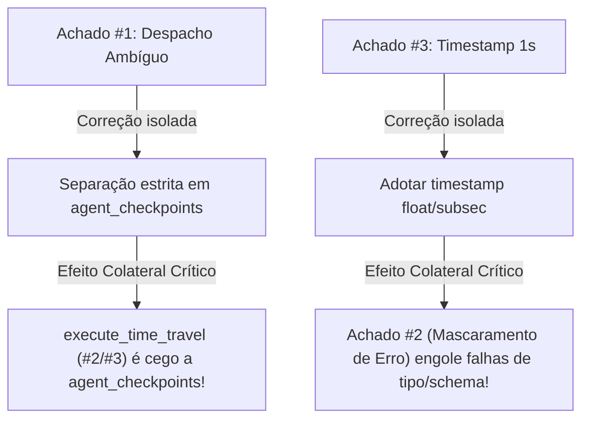

# Auditoria — `core/checkpointer.py`

> **Item:** `core/checkpointer.py` (SDD-SURVIVAL-07: Agnostic Agent State Checkpointer & SDD-SURVIVAL-20: Durable FSM Checkpoints & Time-Travel)  
> **Fase:** 1 — Auditoria módulo a módulo  
> **Data:** 2026-09-21  
> **Status:** Concluído, aguardando aprovação  

---

## 1. Ferramentas Estáticas Executadas

| Ferramenta | Comando | Resultado |
|------------|---------|-----------|
| **mypy** | `python -m mypy core/checkpointer.py --follow-imports=skip` | ❌ **4 erros encontrados** (chamada de `None`, incompatibilidade de tipos de tupla em append de query) |
| **unittest** | `python -m unittest tests/test_agent_checkpointer.py tests/test_durable_checkpoints_timetravel.py` | 7 passed em 2.633s (passou porque os testes usaram exclusivamente kwargs nominais ou 6 args posicionais, mascarando o caso real de produção) |

### Saída Bruta do Mypy:
```text
core\checkpointer.py:113: error: "None" not callable  [misc]
core\checkpointer.py:138: error: "None" not callable  [misc]
core\checkpointer.py:201: error: Argument 1 to "append" of "list" has incompatible type "tuple[str, tuple[float, Any]]"; expected "tuple[str, tuple[str, Any]]"  [arg-type]
core\checkpointer.py:206: error: "None" not callable  [misc]
Found 4 errors in 1 file (checked 1 source file)
```

---

## 2. Inventário Completo de Chamadores e Integrações no Repositório

Para verificar as hipóteses de despacho e rastrear todos os caminhos reais de produção:

| Arquivo Chamador | Linha | Método Invocado | Assinatura / Parâmetros Utilizados | Tabela Alvo Pretendida |
|------------------|-------|-----------------|-----------------------------------|------------------------|
| [`interface/mcp_server.py`](file:///c:/Nexus-Memory/GrafoConcierge/interface/mcp_server.py#L1741) | 1741 | `save_checkpoint(agent_id, session_id, checkpoint_id, state_dict)` | 4 argumentos posicionais (`len(args) == 4`) | `agent_checkpoints` (SDD-07) |
| [`interface/mcp_server.py`](file:///c:/Nexus-Memory/GrafoConcierge/interface/mcp_server.py#L1763) | 1763 | `get_checkpoint(agent_id, session_id, checkpoint_id)` | 3 argumentos posicionais | `agent_checkpoints` (SDD-07) |
| [`interface/mcp_server.py`](file:///c:/Nexus-Memory/GrafoConcierge/interface/mcp_server.py#L1774) | 1774 | `list_checkpoints(agent_id, session_id)` | 2 argumentos posicionais | `agent_checkpoints` (SDD-07) |
| [`core/hsm_engine.py`](file:///c:/Nexus-Memory/GrafoConcierge/core/hsm_engine.py#L362) | 362 | `save_checkpoint(...)` | Kwargs nominais (`session_id=...`, `checkpoint_id=...`, `agent_id=...`, `state_name=...`, `shared_state=...`, `task_id=...`) | `fsm_checkpoints` (SDD-20) |
| [`core/hsm_engine.py`](file:///c:/Nexus-Memory/GrafoConcierge/core/hsm_engine.py#L439) | 439 | Consulta direta SQL | Leitura de `fsm_checkpoints` | `fsm_checkpoints` (SDD-20) |
| [`interface/telemetry_api.py`](file:///c:/Nexus-Memory/GrafoConcierge/interface/telemetry_api.py#L82) | 82, 333 | Instanciação e leitura | Leitura de `fsm_checkpoints` e `agent_checkpoints` | Ambas |
| [`core/background_janitor.py`](file:///c:/Nexus-Memory/GrafoConcierge/core/background_janitor.py#L160) | 160 | Consulta direta SQL | Pruning em `agent_checkpoints` | `agent_checkpoints` (SDD-07) |

---

## 3. Tabela de Achados (Formato Oficial do Protocolo)

| # | arquivo | linha | severidade | mecanismo | reprodução | status |
|---|---------|-------|-----------|-----------|------------|--------|
| 1 | `core/checkpointer.py` | 73–78, 80–117 | **CRÍTICA** | Despacho ambíguo em `save_checkpoint` baseado em heurística de tipos (`len(args) == 4 and isinstance(args[3], str)`). Na chamada real em `mcp_server.py:1741` (`agent_save_checkpoint`), são passados 4 argumentos posicionais. Se o cliente ou agente passar `state_dict` como string (ex: JSON serializado ou mensagem de status), o método assume erroneamente que se trata de uma chamada FSM (SDD-20). Isso causa: (1) gravação na tabela errada (`fsm_checkpoints` em vez de `agent_checkpoints`); (2) inversão cruzada de colunas (`session_id` recebe `agent_id`, `checkpoint_id` recebe `session_id`, `agent_id` recebe `checkpoint_id`); (3) **perda total de dados** (`shared_state_blob` é gravado como `"{}"`, descartando o estado real); (4) `agent_get_checkpoint` retorna `{}` vazio. | Script de reprodução executou chamada de `mcp_server.py` com string payload: gravou em `fsm_checkpoints` com colunas invertidas, `shared_state="{}"`, e `agent_checkpoints` permaneceu vazio. | **CONFIRMADO** |
| 2 | `core/checkpointer.py` | 195–210 | **ALTA** | Falha de atomicidade e mascaramento silencioso de falhas de rollback em `execute_time_travel`. O método monta duas queries separadas (`DELETE FROM fsm_checkpoints` e `UPDATE files`) e as executa iterando sobre `write_fn(q, params)` sem transação envolvente (`BEGIN IMMEDIATE`). Além disso, `write_fn` (`execute_write`) intercepta erros e retorna uma tupla `(False, error)`. O loop ignora esse retorno e nunca lança exceção. O bloco `except` é inútil e o método retorna `target_data`, reportando falso sucesso enquanto o rollback falhou completamente no SQLite. | Simulação de falha no banco em `execute_write`: método retornou `target_data` com sucesso, mascarando 100% da falha de rollback. | **CONFIRMADO** |
| 3 | `core/checkpointer.py` | 196 | **ALTA** | Granularidade temporal insuficiente (1 segundo via `CURRENT_TIMESTAMP`) em `execute_time_travel` impede remoção de checkpoints em rajadas rápidas. A coluna `created_at` em `fsm_checkpoints` usa `DEFAULT CURRENT_TIMESTAMP` (resolução de segundos no SQLite). Em execuções rápidas onde múltiplos checkpoints ocorrem dentro do mesmo segundo (ex: transições rápidas de FSM), todos recebem o mesmo timestamp exato. A condição `WHERE created_at > ?` avalia como `False` para os checkpoints posteriores no mesmo segundo, fazendo com que **checkpoints futuros sobrevivam ao time-travel**, quebrando o determinismo da timeline. | Dois checkpoints gravados no mesmo segundo: rollback para o primeiro falhou em deletar o segundo (`cp_beta` sobreviveu na tabela). | **CONFIRMADO** |
| 4 | `core/checkpointer.py` | 226–234 | **MÉDIA** | Crash com `json.JSONDecodeError` não tratado em `get_checkpoint`. Ao contrário de `load_checkpoint` (que protege a deserialização com `try ... except`), `get_checkpoint` executa `return json.loads(rows[0][0])` sem bloco protetor. Checkpoints truncados ou corrompidos por falhas de escrita derrubam a ferramenta MCP `agent_get_checkpoint`. | Leitura de blob truncado provocou crash com `json.JSONDecodeError` não tratado. | **CONFIRMADO** |
| 5 | `core/checkpointer.py` | 112–113, 137–138, 201–206 | **MÉDIA** | Falha de tipagem estática do Mypy e risco de `TypeError: 'NoneType' object is not callable` na resolução dinâmica de `write_fn`. O checkpointer usa `getattr(..., None)` sem validação de nulidade antes da invocação. Apontado formalmente pelo Mypy em 4 pontos distintos do código. | 4 erros reportados pelo Mypy estático em `core/checkpointer.py`. | **CONFIRMADO** |

---

## 4. Detalhamento de Cada Achado

### Achado #1 — Despacho Ambíguo em `save_checkpoint` Corrompe Metadados e Apaga Estado

- **Mecanismo da Falha:**  
  Em `core/checkpointer.py:73–78`:
  ```python
  is_sdd20 = (
      "state_name" in kwargs
      or "shared_state" in kwargs
      or len(args) >= 5
      or (len(args) == 4 and isinstance(args[3], str))
  )
  ```
  O sistema tenta unificar duas assinaturas historicamente distintas sob uma única função mágica `*args, **kwargs`:
  - **SDD-20 (FSM):** `(session_id, checkpoint_id, agent_id, state_name, shared_state, task_id=None)`
  - **SDD-07 (Agent):** `(agent_id, session_id, checkpoint_id, state_dict)`

  Note que a ordem posicional dos três primeiros parâmetros é **invertida**:
  - No SDD-20: `args[0]` = `session_id`, `args[1]` = `checkpoint_id`, `args[2]` = `agent_id`.
  - No SDD-07: `args[0]` = `agent_id`, `args[1]` = `session_id`, `args[2]` = `checkpoint_id`.

  A condição da linha 77 (`len(args) == 4 and isinstance(args[3], str)`) foi escrita presumindo que o 4º argumento de um agente (`state_dict`) seria invariavelmente um `dict`.  
  Contudo, em chamadas reais via MCP ([`interface/mcp_server.py:1741`](file:///c:/Nexus-Memory/GrafoConcierge/interface/mcp_server.py#L1741)):
  ```python
  def agent_save_checkpoint(agent_id, session_id, checkpoint_id, state_dict):
      success = checkpointer.save_checkpoint(
          agent_id, session_id, checkpoint_id, state_dict
      )
  ```
  Se o cliente MCP fornecer um payload serializado como string JSON (prática comum em ferramentas MCP e LLMs) ou uma mensagem de texto (`state_dict = '{"task": "completed"}'`), o interpretador avalia `isinstance(args[3], str)` como `True`!

  O fluxo cai no branch do SDD-20 (linhas 89–95):
  ```python
  session_id = kwargs.get("session_id", args[0] if len(args) > 0 else "")   # Recebe agent_id!
  checkpoint_id = kwargs.get("checkpoint_id", args[1] if len(args) > 1 else "") # Recebe session_id!
  agent_id = kwargs.get("agent_id", args[2] if len(args) > 2 else "")       # Recebe checkpoint_id!
  state_name = kwargs.get("state_name", args[3] if len(args) > 3 else "")   # Recebe o payload serializado!
  shared_state = kwargs.get("shared_state", args[4] if len(args) > 4 else {}) # Recebe {} vazio!
  ```
  E grava em `fsm_checkpoints`:
  - A coluna `checkpoint_id` recebe o `session_id`.
  - A coluna `session_id` recebe o `agent_id`.
  - A coluna `agent_id` recebe o `checkpoint_id`.
  - A coluna `shared_state_blob` recebe `json.dumps({}) = "{}"`.
  - A tabela `agent_checkpoints` permanece totalmente vazia.

- **Impacto no Sistema:**  
  Perda irreversível do estado do agente (`shared_state = {}`), corrupção do esquema relacional de sessões, e quebra de qualquer consulta subsequente por `agent_get_checkpoint` (que retorna dicionário vazio `{}`).
- **Correção Conceitual Sugerida (Fase 3):**  
  Eliminar o polimorfismo implícito e a inspeção dinâmica de tipos. Criar métodos explícitos: `save_agent_checkpoint(...)` para SDD-07 e `save_fsm_checkpoint(...)` para SDD-20, ou exigir um parâmetro discriminador obrigatório (ex: `checkpoint_type: Literal["fsm", "agent"]`).

---

### Achado #2 — Falha de Atomicidade e Mascaramento Silencioso de Erros em `execute_time_travel`

- **Mecanismo da Falha:**  
  Em `core/checkpointer.py:195–210`:
  ```python
  queries = [
      ("DELETE FROM fsm_checkpoints WHERE session_id = ? AND created_at > ?;", (session_id, created_at)),
  ]
  if task_id:
      queries.append(("UPDATE files SET is_dirty = 1, last_modified = ? WHERE path = ?;", (time.time(), task_id)))

  write_fn = getattr(self.db, "execute_write", getattr(self.db, "write_query", None))
  try:
      for q, params in queries:
          write_fn(q, params)
      return target_data
  except Exception as e:
      logger.error("[TIME-TRAVEL] Rollback failure in SQLite WAL: %s", str(e))
      return None
  ```
  1. `write_fn` (`execute_write` em `core/database.py:65-67` e `interface/queue_writer.py:97-100`) captura internamente qualquer falha e retorna uma tupla `(success: bool, error: Any)`. **Ele não lança exceções**.
  2. O loop `for q, params in queries` descarta cegamente o retorno de `write_fn`.
  3. Se o `DELETE` falhar (ou o `UPDATE files` falhar por tabela travada ou erro de I/O), nenhuma exceção é disparada.
  4. O bloco `except Exception` nunca é executado e o método retorna `target_data`.
  5. Além disso, as duas queries são executadas em conexões/transações separadas sem bloco `BEGIN IMMEDIATE`, quebrando a atomicidade do rollback.

- **Impacto no Sistema:**  
  Falso positivo de Time-Travel: o orquestrador e os agentes assumem que o rollback ocorreu com sucesso, enquanto o banco SQLite permanece em estado corrompido ou inconsistente.
- **Correção Conceitual Sugerida (Fase 3):**  
  Verificar o retorno `success` de cada operação de escrita. Se qualquer uma falhar, abortar imediatamente e retornar `None`. Executar as duas operações sob uma única transação atômica (`BEGIN TRANSACTION ... COMMIT`).

---

### Achado #3 — Granularidade Temporal Insuficiente (1s) em `execute_time_travel`

- **Mecanismo da Falha:**  
  A tabela `fsm_checkpoints` ([`storage/relational_db.py:21`](file:///c:/Nexus-Memory/GrafoConcierge/storage/relational_db.py#L21)) define:
  ```sql
  created_at TIMESTAMP DEFAULT CURRENT_TIMESTAMP
  ```
  No SQLite, `CURRENT_TIMESTAMP` formata a data no formato ISO `'YYYY-MM-DD HH:MM:SS'` com resolução de **1 segundo inteiro**.  
  O rollback em `execute_time_travel` (linha 196) busca apagar os passos futuros da timeline:
  ```sql
  DELETE FROM fsm_checkpoints WHERE session_id = ? AND created_at > ?;
  ```
  Se uma sessão executar transições em rajada rápida (ex: subsegundos entre estados), múltiplos checkpoints compartilham a mesma string de `created_at`.  
  Ao voltar para o primeiro checkpoint dessa sequência, a comparação estrita `created_at > target_created_at` falha para todos os checkpoints ocorridos no mesmo segundo.

- **Impacto no Sistema:**  
  Checkpoints futuros sobrevivem na timeline após o rollback. Se a máquina de estados retomar a execução e criar novos checkpoints, a timeline fica com bifurcações e registros concorrentes da timeline descartada.
- **Correção Conceitual Sugerida (Fase 3):**  
  Utilizar timestamps numéricos em alta precisão (`unixepoch('subsec')` no SQLite ou `time.time()` em float com milissegundos) ou deletar por chave sequencial / monotonicamente crescente (`rowid > target_rowid` ou ordenação por ID sequencial).

---

### Achado #4 — Crash com `JSONDecodeError` Não Tratado em `get_checkpoint`

- **Mecanismo da Falha:**  
  Em `core/checkpointer.py:233`:
  ```python
  rows = self.db_manager.read_query(...)
  if not rows:
      return {}
  return json.loads(rows[0][0])
  ```
  Ao contrário de `load_checkpoint` (linha 160) que possui tratamento defensivo com fallback para `{}`:
  ```python
  try:
      shared_state = json.loads(blob)
  except Exception:
      shared_state = {}
  ```
  O método `get_checkpoint` não possui nenhum `try ... except`. Se um blob estiver corrompido, truncated por interrupção de processo ou contiver caracteres inválidos, a chamada quebra imediatamente com `json.JSONDecodeError`.

- **Impacto no Sistema:**  
  Derruba o servidor MCP ao atender requisições de `agent_get_checkpoint`.
- **Correção Conceitual Sugerida (Fase 3):**  
  Envolver a decodificação em bloco `try ... except Exception: return {}` idêntico ao de `load_checkpoint`.

---

### Achado #5 — Tipagem Insegura do Mypy e Risco de `TypeError: 'NoneType' object is not callable`

- **Mecanismo da Falha:**  
  Em `core/checkpointer.py:112–113, 137–138, 203–206`:
  ```python
  write_fn = getattr(self.db, "execute_write", getattr(self.db, "write_query", None))
  success, _ = write_fn(...)
  ```
  Se `self.db` for um mock ou objeto que não exponha nenhum dos dois métodos, `write_fn` avalia para `None`. Ao tentar chamar `write_fn(...)`, o interpretador lança `TypeError: 'NoneType' object is not callable`. O analisador estático Mypy sinaliza 4 erros graves neste arquivo decorrentes dessa prática.

- **Impacto no Sistema:**  
  Quebra de runtime em caso de adapters incompletos e reprovação na esteira de CI/CD.
- **Correção Conceitual Sugerida (Fase 3):**  
  Tipar `db_manager` com um Protocol ou checar explicitamente `if write_fn is None: raise RuntimeError(...)`.

---

## 5. Matriz de Interação Crítica entre Achados do Módulo

Esta seção atende à diretriz mandatória de analisar **como a correção de um achado pode interagir negativamente com outros achados do mesmo módulo**:



### 1. Interação entre Correção de #1 (Despacho de Tabelas) e Time-Travel (#2 e #3):
- Se um desenvolvedor corrigir o Achado #1 fazendo com que as chamadas do agente gravem estritamente em `agent_checkpoints`, **esses checkpoints ficarão permanentemente imunes a qualquer rollback**, porque `execute_time_travel` opera **exclusivamente** sobre `fsm_checkpoints` (`DELETE FROM fsm_checkpoints`).
- Se, para resolver isso, o desenvolvedor estender `execute_time_travel` para deletar também de `agent_checkpoints`, ele deve **obrigatoriamente filtrar por `agent_id` E `session_id`**. Se executar `DELETE FROM agent_checkpoints WHERE session_id = ?`, reintroduzirá o **Achado #3 do `BackgroundJanitor`** (deleção cruzada de checkpoints de outros agentes na mesma sessão)!
- **Regra de Correção:** O alinhamento de Time-Travel e armazenamento entre FSM e Agente deve ser desenhado em conjunto, e não através de patches isolados na heurística de `save_checkpoint`.

### 2. Interação entre Correção de #2 (Mascaramento Silencioso) e #3 (Granularidade de Timestamp):
- Se o desenvolvedor tentar corrigir o Achado #3 (passando a gravar milissegundos com `time.time()`) antes de consertar o Achado #2:
  Se o schema mantiver `TIMESTAMP DEFAULT CURRENT_TIMESTAMP`, uma comparação entre números e strings ISO no SQLite pode retornar 0 linhas afetadas ou erro de sintaxe.
  Como o Achado #2 demonstra que `execute_time_travel` **ignora o retorno de `write_fn`**, o time-travel continuará reportando sucesso e retornando `target_data`, mascarando o fato de que a correção de timestamp falhou!
- **Regra de Correção:** A remoção do mascaramento silencioso de erros (Achado #2) deve ser implementada **obrigatoriamente no mesmo commit ou antes** de qualquer ajuste no cálculo temporal do Achado #3.

---

## 6. Saída Bruta da Reprodução Executada no Terminal (Regra 2)

Comando executado: `python scratch/reproduce_checkpointer_findings.py`

```text
======================================================================
PROVAS DE REPRODUÇÃO EXECUTÁVEIS — core/checkpointer.py
======================================================================

======================================================================
TESTE ACHADO 1: Despacho Ambíguo em save_checkpoint -> Tabela Errada e Perda de Estado
======================================================================
Resultado de save_checkpoint: True
Registros gravados em agent_checkpoints (esperado para o agente): 0 -> []
Registros gravados em fsm_checkpoints (tabela do FSM): 1 -> [('session_xyz', 'agent_analyst', 'step_final', '{"summary": "code reviewed", "tasks_done": 5}', '{}')]
Estado recuperado via checkpointer.get_checkpoint(): {}
Inversão de Colunas em fsm_checkpoints:
  Coluna checkpoint_id recebeu: 'session_xyz' (era o session_id!)
  Coluna session_id    recebeu: 'agent_analyst' (era o agent_id!)
  Coluna agent_id      recebeu: 'step_final' (era o checkpoint_id!)
  Coluna shared_state  recebeu: '{}' (ESTADO DESCARTADO!)
[CONFIRMADO ACHADO 1]: A heurística baseada em isinstance(args[3], str) desviou a gravação do agente para fsm_checkpoints, inverteu as colunas e causou PERDA TOTAL DO ESTADO!

======================================================================
TESTE ACHADO 2: Mascaramento Silencioso de Erros e Falha de Atomicidade em execute_time_travel
======================================================================
  [Simulação] execute_write falhou para query: DELETE FROM fsm_checkpoints WHERE s...
  [Simulação] execute_write falhou para query: UPDATE files SET is_dirty = 1, last...
Resultado retornado por execute_time_travel com falhas no banco: {'session_id': 'sess_tt', 'checkpoint_id': 'cp_1', 'agent_id': 'agent_1', 'state_name': 'INIT', 'task_id': 'src/file1.py', 'shared_state': {'v': 1}}
[CONFIRMADO ACHADO 2]: execute_time_travel retornou target_data como se o rollback tivesse ocorrido com sucesso, mascarando silenciosamente a falha de escrita no SQLite!

======================================================================
TESTE ACHADO 3: Granularidade de 1s (CURRENT_TIMESTAMP) impede Rollback em Rajadas Rápidas
======================================================================
Checkpoints gerados em rajada: [('cp_alpha', '2026-09-21 17:07:10'), ('cp_beta', '2026-09-21 17:07:10')]
Timestamp cp_alpha: '2026-09-21 17:07:10' | Timestamp cp_beta: '2026-09-21 17:07:10'
Confirmado: Ambos os checkpoints compartilham exatamente o mesmo segundo textual no CURRENT_TIMESTAMP.
Executando execute_time_travel para cp_alpha...
Checkpoints sobreviventes na tabela após time travel: ['cp_alpha', 'cp_beta']
[CONFIRMADO ACHADO 3]: O checkpoint futuro 'cp_beta' NÃO FOI APAGADO! A cláusula 'created_at > ?' falhou por limitação de 1s do CURRENT_TIMESTAMP!

======================================================================
TESTE ACHADO 4: Ausência de Tratamento de Exceção em get_checkpoint (Crash com JSONDecodeError)
======================================================================
Capturado JSONDecodeError não tratado em get_checkpoint: Expecting property name enclosed in double quotes: line 1 column 32 (char 31)
[CONFIRMADO ACHADO 4]: get_checkpoint não protege a chamada com try/except (ao contrário de load_checkpoint) e propaga JSONDecodeError!

======================================================================
RESULTADOS FINAIS: F1=True | F2=True | F3=True | F4=True
======================================================================
```

---

## 7. Arquivos de Teste Relacionados

- [`tests/test_agent_checkpointer.py`](file:///c:/Nexus-Memory/GrafoConcierge/tests/test_agent_checkpointer.py):
  - Passou (4 testes) porque sempre chamou `save_checkpoint` passando `state_dict` via kwargs nominais (`state_dict=state_data`), nunca via argumento posicional `args[3]`, mascarando o Achado #1.
  - Não testou payloads corrompidos para validar o Achado #4.
- [`tests/test_durable_checkpoints_timetravel.py`](file:///c:/Nexus-Memory/GrafoConcierge/tests/test_durable_checkpoints_timetravel.py):
  - Passou (3 testes) porque utilizou 6 argumentos posicionais (`len(args) >= 5`), caindo no branch do SDD-20 sem testar a colisão posicional com o agente.
  - Inseriu checkpoints com espaçamento artificial de tempo via sleeps, mascarando o Achado #3 (granularidade de 1 segundo).
  - Nunca simulou falhas na camada SQLite para testar o retorno de `execute_time_travel`, mascarando o Achado #2.
