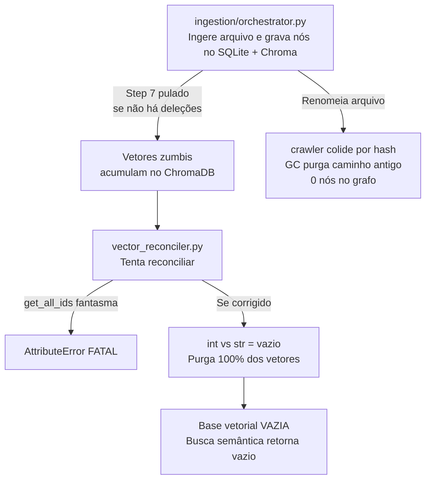
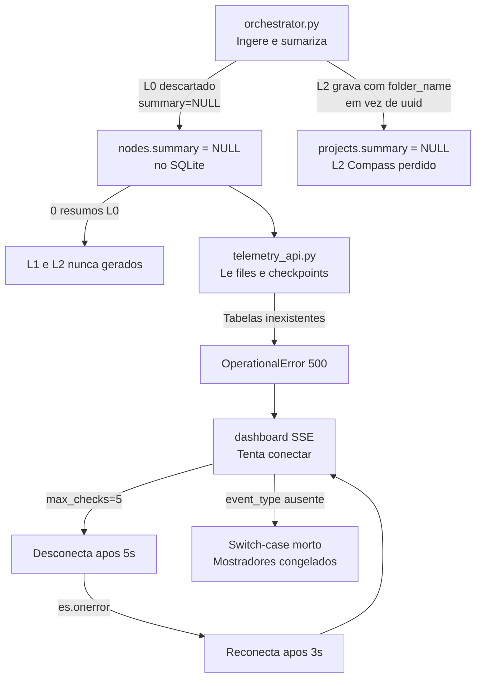
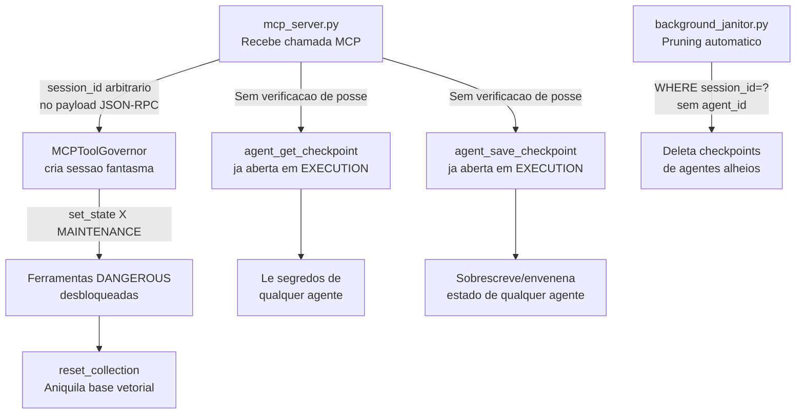
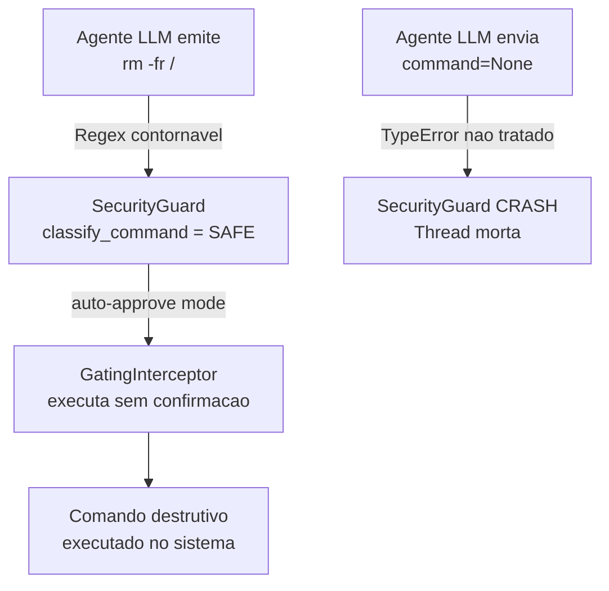

# Fase 2 — Cruzamento Transversal de Módulos

> **Fase:** 2 — Cruzamento transversal (`cruzamento-modulos`)  
> **Data:** 2026-09-30  
> **Fontes:** Todos os 15 relatórios de `audits/*.md` da Fase 1 (21 itens)  
> **Status:** ▶ EM ANDAMENTO  

---

## 0. Como ler este documento

Este relatório **não relê código-fonte**. Trabalha exclusivamente sobre os 15 relatórios da Fase 1, cruzando achados para revelar padrões sistêmicos invisíveis quando cada módulo é lido isoladamente.

Cada Eixo de Cruzamento é uma cadeia causal que conecta achados de 2+ relatórios, gerando uma consequência que nenhum relatório individual pode declarar sozinho.

---

## 1. EIXO CENTRAL DE COLAPSO SISTÊMICO — `core/database.py::ConciergeDatabaseManager`

> [!CAUTION]
> ### O Componente Mais Frágil e Enganoso de Toda a Arquitetura
> A convergência entre [`duplicacao-serialized-write-queue.md`](file:///c:/Nexus-Memory/GrafoConcierge/audits/duplicacao-serialized-write-queue.md) e [`schema-oficial-incompleto.md`](file:///c:/Nexus-Memory/GrafoConcierge/audits/schema-oficial-incompleto.md) expõe que `ConciergeDatabaseManager` falha em **ambas** as dimensões fundamentais de um gerenciador de banco de dados: a camada de escrita e a camada de schema.

### 1.1 Dimensão de Escrita: Zero Fila + Zero FKs + Conexões Efêmeras

| Relatório Fonte | Achado(s) | Contribuição para a Cadeia |
|---|---|---|
| [`duplicacao-serialized-write-queue.md`](file:///c:/Nexus-Memory/GrafoConcierge/audits/duplicacao-serialized-write-queue.md) | #1, #2, #3 | Em produção (`mcp_server.py:166`), `ConciergeDatabaseManager` é instanciado com `write_queue=None`. Cada escrita dispara `sqlite3.connect` efêmero sem serialização, sem mutex e sem `PRAGMA foreign_keys=ON`. |
| [`core-delta-manager.md`](file:///c:/Nexus-Memory/GrafoConcierge/audits/core-delta-manager.md) | #3 | `_insert_new_file` e `_update_structural_change` executam 2 `write_query` separadas sem transação envolvente — cada uma via conexão efêmera distinta. |
| [`core-background-janitor.md`](file:///c:/Nexus-Memory/GrafoConcierge/audits/core-background-janitor.md) | #5 | `run_idle_summarization` emite 2 queries de escrita (`UPDATE communities` e `UPDATE files`) em 2 conexões efêmeras cruas distintas, sem serialização. |
| [`core-checkpointer.md`](file:///c:/Nexus-Memory/GrafoConcierge/audits/core-checkpointer.md) | #2 | `execute_time_travel` monta N queries de escrita iteradas sem `BEGIN IMMEDIATE` e sem transação envolvente. |

**Consequência sistêmica cruzada:** Todos os módulos de `core/` que passam pelo `ConciergeDatabaseManager` escrevem no mesmo `data/concierge.db` simultaneamente com a fila real de `storage/connection.py`. Sob qualquer carga concorrente (ex: 2 agentes MCP + janitor em background + watcher), a probabilidade de `database is locked` é alta. A fila de `storage/` aborta aos 5s (`busy_timeout=5000`), enquanto `core/` aguarda até 30s (`timeout=30`) — gerando falhas assimétricas e imprevisíveis.

### 1.2 Dimensão de Schema: `_init_tables()` Cria Apenas `test_log`

| Relatório Fonte | Achado(s) | Contribuição para a Cadeia |
|---|---|---|
| [`schema-oficial-incompleto.md`](file:///c:/Nexus-Memory/GrafoConcierge/audits/schema-oficial-incompleto.md) | #1, #2, #3 | O bootstrap oficial cria apenas 8 tabelas (Silo 1 / Storage v3.8.0). As 5 tabelas de `core/` (`files`, `communities`, `ast_edges`, `agent_checkpoints`, `fsm_checkpoints`) não existem. `_init_tables()` cria apenas `test_log`. |
| [`core-checkpointer.md`](file:///c:/Nexus-Memory/GrafoConcierge/audits/core-checkpointer.md) | #1, #2 | `save_checkpoint` e `execute_time_travel` escrevem em `agent_checkpoints` e `fsm_checkpoints` — tabelas que nunca são criadas em instalação limpa. |
| [`core-delta-manager.md`](file:///c:/Nexus-Memory/GrafoConcierge/audits/core-delta-manager.md) | #3, #4 | Escreve em `files` e lê `communities` — tabelas ausentes do schema oficial. |
| [`core-background-janitor.md`](file:///c:/Nexus-Memory/GrafoConcierge/audits/core-background-janitor.md) | #3, #4, #5 | Lê `agent_checkpoints`, `files` e `communities` — todas ausentes. |
| [`core-vector-reconciler.md`](file:///c:/Nexus-Memory/GrafoConcierge/audits/core-vector-reconciler.md) | #2 | Lê `files` via `SELECT path FROM files` — tabela ausente. |
| [`interface-telemetry-api.md`](file:///c:/Nexus-Memory/GrafoConcierge/audits/interface-telemetry-api.md) | #1 | Consulta `files` e `agent_checkpoints` — ambas ausentes. |

**Consequência sistêmica cruzada:** Em **qualquer instalação limpa** (`git clone` + `python main.py`), 100% dos subsistemas analíticos de `core/` e a API de telemetria sofrem crash imediato com `OperationalError: no such table`. O log de boot diz `Schema v3.8.0 verified - all tables and triggers OK` — uma falsa confirmação de integridade, já que `verify_tables_exist()` só valida as tabelas que o próprio `SchemaManager` conhece.

### 1.3 Síntese do Eixo Central

```
┌──────────────────────────────────────────────────────────────┐
│                ConciergeDatabaseManager                      │
│                                                              │
│   ESCRITA                         SCHEMA                     │
│   ┌───────────────────┐          ┌───────────────────┐       │
│   │ write_queue=None  │          │ _init_tables():   │       │
│   │ → sqlite3.connect │          │   CREATE test_log │       │
│   │   efêmero por     │          │   (NADA mais)     │       │
│   │   query, sem fila,│          │                   │       │
│   │   sem FKs, sem    │          │ Schema oficial    │       │
│   │   mutex            │          │ omite:           │       │
│   └───────────────────┘          │  · files          │       │
│           │                      │  · communities    │       │
│           ▼                      │  · ast_edges      │       │
│   Colide com a fila              │  · agent_ckpts    │       │
│   real de storage/               │  · fsm_ckpts      │       │
│   connection.py                  └───────────────────┘       │
│                                          │                   │
│                                          ▼                   │
│                              OperationalError em             │
│                              12 módulos de core/             │
│                              + interface/                    │
└──────────────────────────────────────────────────────────────┘
```

**Veredicto:** `ConciergeDatabaseManager` é uma **fachada vazia** — nem a camada de escrita (zero fila, zero FKs, conexões efêmeras) nem a de schema (`_init_tables` cria `test_log`, nada mais) cumprem o que a documentação `01_ARCHITECTURE.md` especifica. Em produção, ele simultaneamente **corrompe** a integridade do banco (por colisão com a fila real de `storage/`) e **falha catastroficamente** (por escrever em tabelas inexistentes).

---

## 2. SUPOSIÇÕES INCOMPATÍVEIS ENTRE MÓDULOS

### 2.1 Ontologia do Dado: `int` (node IDs) vs `str` (file paths)

| Par de Módulos | Suposição do Módulo A | Suposição do Módulo B | Consequência |
|---|---|---|---|
| `core/vector_reconciler.py` ↔ `storage/vector_store.py` | Reconciliador assume que IDs vetoriais são comparáveis com `SELECT path FROM files` (strings) | `ChromaVectorStore.get_all_stored_node_ids()` retorna `set[int]` (IDs de nós AST) | Interseção `int ∩ str = ∅` → **purga matematicamente garantida de 100% dos vetores** ([`core-vector-reconciler.md`](file:///c:/Nexus-Memory/GrafoConcierge/audits/core-vector-reconciler.md) #2) |
| `agents/revisor_critico.py` ↔ busca vetorial | `_llm_rerank` faz `int(nid)` nos IDs de nós | Nós vetoriais e paths vêm como `str` | `int("")` → `ValueError`, descartando 100% dos candidatos ([`agent-and-agents.md`](file:///c:/Nexus-Memory/GrafoConcierge/audits/agent-and-agents.md) #5) |
| `storage/logic.py` ↔ `commit_log` | `_calculate_decay` faz `datetime.utcnow() - fromisoformat(ts)` | Timestamps offset-aware (`"Z"` ou `"+00:00"`) | `TypeError` → score degradado para `0.01` sempre ([`storage.md`](file:///c:/Nexus-Memory/GrafoConcierge/audits/storage.md) #5) |
| `grafo-dashboard-web/CoreMemoryPanel` ↔ backend | Frontend concatena `+ "Z"` em timestamps | Backend já pode enviar ISO com `Z` | `"2026-09-25T12:00:00ZZ"` → `Invalid Date` ([`grafo-dashboard-web.md`](file:///c:/Nexus-Memory/GrafoConcierge/audits/grafo-dashboard-web.md) #6) |

### 2.2 Contrato de Métodos: Mock vs Classe Real

| Par de Módulos | Método Fantasma | Onde é Chamado | Classe Real | Consequência |
|---|---|---|---|---|
| `core/vector_reconciler.py` ↔ `storage/base_backend.py` | `get_all_ids()` | `vector_reconciler.py:39` | `BaseVectorBackend` / `ChromaVectorStore` (não implementam) | `AttributeError` fatal ([`mock-vs-real-audit.md`](file:///c:/Nexus-Memory/GrafoConcierge/audits/mock-vs-real-audit.md) #1, [`core-vector-reconciler.md`](file:///c:/Nexus-Memory/GrafoConcierge/audits/core-vector-reconciler.md) #1) |
| `core/hsm_engine.py` ↔ `core/delta_manager.py` | `has_structural_change()` | `hsm_engine.py:458` | `DeltaManager` (não implementa) | `AttributeError` fatal ([`core-delta-manager.md`](file:///c:/Nexus-Memory/GrafoConcierge/audits/core-delta-manager.md) #1, [`mock-vs-real-audit.md`](file:///c:/Nexus-Memory/GrafoConcierge/audits/mock-vs-real-audit.md) #2) |
| `core/federated_knowledge_router.py` ↔ *nenhum* | `query_docs()` | `federated_knowledge_router.py:73` | Nenhuma classe de produção implementa | Contrato puramente fantasma ([`mock-vs-real-audit.md`](file:///c:/Nexus-Memory/GrafoConcierge/audits/mock-vs-real-audit.md) #3) |

### 2.3 Integridade Referencial Assimétrica

| Silo | PRAGMA `foreign_keys` | Consequência |
|---|---|---|
| `storage/connection.py` (fila real) | `ON` ✅ | Rejeita arestas órfãs com `IntegrityError` |
| `core/database.py` (zero fila) | `OFF` (padrão SQLite) ❌ | Aceita qualquer `source_id` / `target_id` inexistente |
| **Resultado cruzado** | Colisão sobre o **mesmo banco físico** `data/concierge.db` | `core/` pode inserir arestas apontando para nós inexistentes; `storage/` tentará lê-las e falhará em joins e CTEs com dados órfãos. ([`duplicacao-serialized-write-queue.md`](file:///c:/Nexus-Memory/GrafoConcierge/audits/duplicacao-serialized-write-queue.md) #3) |

### 2.4 Timeout de Banco Assimétrico

| Camada | `busy_timeout` | Fonte |
|---|---|---|
| `storage/connection.py` | 5.000 ms | `PRAGMA busy_timeout=5000;` |
| `core/database.py` | 30.000 ms | `sqlite3.connect(timeout=30.0)` |
| `interface/queue_writer.py` (morta em produção) | 30.000 ms | `sqlite3.connect(timeout=30.0)` |

**Consequência cruzada:** Sob contenção sustentada (>5s), a fila de `storage/` aborta prematuramente com `OperationalError: database is locked`, enquanto `core/` continua aguardando. Módulos do `storage/` falham e retornam erro ao chamador; módulos do `core/` bloqueiam por até 30s. O comportamento do sistema sob carga torna-se imprevisível e não-reprodutível. ([`duplicacao-serialized-write-queue.md`](file:///c:/Nexus-Memory/GrafoConcierge/audits/duplicacao-serialized-write-queue.md) #4)

---

## 3. FALTA DE ISOLAMENTO ENTRE PROJETOS / TENANTS

### 3.1 Busca Vetorial Cross-Project

| Módulo | Achado | Mecanismo |
|---|---|---|
| [`storage/vector_store.py`](file:///c:/Nexus-Memory/GrafoConcierge/audits/storage.md) (#6) | Quando `project_uuids=[]`, `_build_where_filter` não adiciona filtro de projeto | A busca retorna vetores de **todos** os projetos da coleção |
| Impacto | Dados confidenciais de projetos `RESTRICTED` podem vazar para consultas de projetos `PUBLIC` | Violação de *Strict Scoping* anunciado |

### 3.2 Checkpoints Sem Verificação de Posse

| Módulo | Achado | Mecanismo |
|---|---|---|
| [`bypass-governanca-por-session-id.md`](file:///c:/Nexus-Memory/GrafoConcierge/audits/bypass-governanca-por-session-id.md) (#2) | `agent_get_checkpoint` (READ_ONLY) e `agent_save_checkpoint` (LOCAL_MUTATION) já estão abertas no estado `EXECUTION` | Qualquer chamador pode ler/sobrescrever checkpoints de qualquer agente usando `agent_id` alheio |
| [`core-background-janitor.md`](file:///c:/Nexus-Memory/GrafoConcierge/audits/core-background-janitor.md) (#3) | `_prune_single_session` agrupa por `session_id` sem filtrar `agent_id` | Pruning deleta checkpoints de agentes secundários na mesma sessão |

### 3.3 Privacidade Multinível Contornável

| Módulo | Achado | Mecanismo |
|---|---|---|
| [`agent-and-agents.md`](file:///c:/Nexus-Memory/GrafoConcierge/audits/agent-and-agents.md) (#2) | `check_contamination` usa `.get(source_privacy, 0)` sem `.upper()` | Qualquer rótulo em minúsculas (`"restricted"`) ou sinônimo (`"CONFIDENTIAL"`) recebe nível 0 (PUBLIC) |
| Gravidade | O fallback é `Fail-Open` para PUBLIC em vez de `Fail-Closed` para RESTRICTED | Transferência irrestrita de dados ultra-secretos para contextos públicos |

### 3.4 Cadeia de Isolamento Comprometida

```
  Busca vetorial    →   project_uuids=[]   →   Dados de todos os projetos retornados
       ↓
  check_contamination  →   "restricted" → nível 0 → aprovado como PUBLIC
       ↓
  Checkpoints         →   Sem posse    →   Qualquer agente lê/escreve qualquer checkpoint
       ↓
  Pruning             →   Sem agent_id →   Dados de agentes alheios deletados
```

**Veredicto:** O isolamento multi-tenant do Grafo Concierge é **nominalmente declarado** mas **estruturalmente inexistente** em quatro camadas independentes.

---

## 4. FUNCIONALIDADE DOCUMENTADA NÃO IMPLEMENTADA

### 4.1 Mapa Completo de Funcionalidade Fantasma

| Funcionalidade Documentada | Fonte da Promessa | Realidade no Código | Relatório(s) |
|---|---|---|---|
| **Serialized Write Queue** unificada eliminando `database is locked` | `01_ARCHITECTURE.md` | `write_queue=None` em produção; zero fila; `queue_writer.py` é código morto | [`duplicacao-serialized-write-queue.md`](file:///c:/Nexus-Memory/GrafoConcierge/audits/duplicacao-serialized-write-queue.md) #1–#2 |
| **13 tabelas relacionais** (incluindo `files`, `communities`, `ast_edges`, `agent_checkpoints`, `fsm_checkpoints`) | `01_ARCHITECTURE.md` | Apenas 8 tabelas + 1 FTS5 criadas; 5 tabelas totalmente ausentes | [`schema-oficial-incompleto.md`](file:///c:/Nexus-Memory/GrafoConcierge/audits/schema-oficial-incompleto.md) #1 |
| **Progressive Tool Disclosure** (agentes só veem ferramentas do estado atual) | SDD-SURVIVAL-23 | `list_tools()` expõe 100% das 31 ferramentas; sem `session_id` no protocolo | [`bypass-governanca-por-session-id.md`](file:///c:/Nexus-Memory/GrafoConcierge/audits/bypass-governanca-por-session-id.md) #3 |
| **Harel Statecharts (HSM)** com Deep History Nodes e Circuit Breaker | SDD-SURVIVAL-17–20 | 100% desconectado do servidor MCP; estado é string em dicionário | [`bypass-governanca-por-session-id.md`](file:///c:/Nexus-Memory/GrafoConcierge/audits/bypass-governanca-por-session-id.md) #4 |
| **Background Vector Reconciler** (reconciliação de vetores órfãos) | SDD-SURVIVAL-05 | Inoperante: método fantasma `get_all_ids()`; se corrigido, purga 100% | [`core-vector-reconciler.md`](file:///c:/Nexus-Memory/GrafoConcierge/audits/core-vector-reconciler.md) #1–#2 |
| **Delta Engine** (detecção de mudanças estruturais) | SDD-SURVIVAL-04 | `has_structural_change()` inexistente no `DeltaManager` | [`core-delta-manager.md`](file:///c:/Nexus-Memory/GrafoConcierge/audits/core-delta-manager.md) #1 |
| **Smart Checkpoint Pruning** com preservação de ponto-zero | SDD-SURVIVAL-14 | `keep_limit=0` preserva 100% por bug de slice `[-0:]`; pruning deleta cross-agent | [`core-background-janitor.md`](file:///c:/Nexus-Memory/GrafoConcierge/audits/core-background-janitor.md) #1, #3 |
| **Boundary Guard** (proteção contra comandos destrutivos) | SDD-SURVIVAL-24 | Regex contornável com `rm -fr /`, `rm -rf .`, `del /f /s /q C:\*` | [`core-security-guard.md`](file:///c:/Nexus-Memory/GrafoConcierge/audits/core-security-guard.md) #1 |
| **RateGovernor** (controle de tráfego com prioridade) | SDD-SURVIVAL-23 | Vazamento de `unfinished_tasks` com deadlock; starvation total de LOW 75–100% | [`core-rate-governor.md`](file:///c:/Nexus-Memory/GrafoConcierge/audits/core-rate-governor.md) #1–#2 |
| **Telemetria SSE contínua** (stream em tempo real) | `telemetry_api.py` | Aborta após 5s por `max_checks=5`; hash invalidado por `datetime.now()` | [`interface-telemetry-api.md`](file:///c:/Nexus-Memory/GrafoConcierge/audits/interface-telemetry-api.md) #3–#4 |
| **Dashboard HUD Cognitivo** (observabilidade em tempo real) | `grafo-dashboard-web/` | Mostradores congelados, flapping SSE, portas colidindo, InspectorDrawer vazio | [`grafo-dashboard-web.md`](file:///c:/Nexus-Memory/GrafoConcierge/audits/grafo-dashboard-web.md) #1–#5 |
| **Sumarização Multinível** (L0 → L1 → L2 Compass) | SDD-SURVIVAL-01 | L0 descartado (summary=NULL); L2 gravado com `folder_name` em vez de `uuid` | [`ingestion.md`](file:///c:/Nexus-Memory/GrafoConcierge/audits/ingestion.md) #2–#3 |
| **Cliente MCP Federado** (`external_mcp.query_docs`) | `federated_knowledge_router.py` | Nenhuma classe real implementa `query_docs`; contrato fantasma | [`mock-vs-real-audit.md`](file:///c:/Nexus-Memory/GrafoConcierge/audits/mock-vs-real-audit.md) #3 |

---

## 5. A ILUSÃO DOS TESTES (THE TEST MIRAGE) — Padrão Sistêmico

> [!WARNING]
> ### Padrão Recorrente em 14+ Suítes de Teste
> A suíte de testes não é apenas incompleta — ela **mascara ativamente** bugs de produção.

| Tipo de Mascaramento | Relatórios que Confirmam | Contagem |
|---|---|---|
| **Schema fantasma**: Testes criam tabelas inexistentes em `setUp()` | [`schema-oficial-incompleto.md`](file:///c:/Nexus-Memory/GrafoConcierge/audits/schema-oficial-incompleto.md) #4 | 14 suítes |
| **Métodos fantasma**: Mocks implementam métodos que a classe real não possui | [`mock-vs-real-audit.md`](file:///c:/Nexus-Memory/GrafoConcierge/audits/mock-vs-real-audit.md) #1–#3 | 4 mocks críticos |
| **Fila fantasma**: Testes injetam `write_queue` que produção não usa | [`duplicacao-serialized-write-queue.md`](file:///c:/Nexus-Memory/GrafoConcierge/audits/duplicacao-serialized-write-queue.md) #2 | 11 suítes |
| **Assinatura divergente**: Mocks aceitam parâmetros diferentes da classe real | [`mock-vs-real-audit.md`](file:///c:/Nexus-Memory/GrafoConcierge/audits/mock-vs-real-audit.md) #5–#7 | 5 mocks |

**Consequência sistêmica:** A suíte de testes inteira reporta `100% passed` enquanto o sistema real é fundamentalmente inoperante. Os testes validam uma versão imaginária do software que jamais existiu em produção.

---

## 6. CADEIAS DE FALHA TRANSVERSAIS

### 6.1 Cadeia "Ingestão → Reconciliação → Purga Total"



**Fontes:** [`ingestion.md`](file:///c:/Nexus-Memory/GrafoConcierge/audits/ingestion.md) #1, #4 → [`core-vector-reconciler.md`](file:///c:/Nexus-Memory/GrafoConcierge/audits/core-vector-reconciler.md) #1, #2

### 6.2 Cadeia "Sumarização → Telemetria → Dashboard Morto"



**Fontes:** [`ingestion.md`](file:///c:/Nexus-Memory/GrafoConcierge/audits/ingestion.md) #2, #3 → [`interface-telemetry-api.md`](file:///c:/Nexus-Memory/GrafoConcierge/audits/interface-telemetry-api.md) #1, #3, #4 → [`grafo-dashboard-web.md`](file:///c:/Nexus-Memory/GrafoConcierge/audits/grafo-dashboard-web.md) #1, #2

### 6.3 Cadeia "Governança → Checkpoints → Envenenamento Cross-Agent"



**Fontes:** [`bypass-governanca-por-session-id.md`](file:///c:/Nexus-Memory/GrafoConcierge/audits/bypass-governanca-por-session-id.md) #1, #2 → [`core-background-janitor.md`](file:///c:/Nexus-Memory/GrafoConcierge/audits/core-background-janitor.md) #3 → [`core-checkpointer.md`](file:///c:/Nexus-Memory/GrafoConcierge/audits/core-checkpointer.md) #1

### 6.4 Cadeia "SecurityGuard → GatingInterceptor → Destruição Automatizada"



**Fontes:** [`core-security-guard.md`](file:///c:/Nexus-Memory/GrafoConcierge/audits/core-security-guard.md) #1, #2

---

## 7. CÓDIGO MORTO E ÓRFÃO EM PRODUÇÃO — Inventário Consolidado

| Módulo / Classe | Status em Produção | Testes que Exercitam | Relatório |
|---|---|---|---|
| `interface/queue_writer.py::SerializedWriteQueue` | **CÓDIGO MORTO** (testado em 11 suítes, jamais instanciado em `mcp_server.py`) | 11 suítes | [`duplicacao-serialized-write-queue.md`](file:///c:/Nexus-Memory/GrafoConcierge/audits/duplicacao-serialized-write-queue.md) #2 |
| `agent/run_agent.py::CognitiveAgentRunner` | **CÓDIGO ÓRFÃO** (não instanciado pelo servidor MCP) | `test_agent_hsm_coupling.py` | [`bypass-governanca-por-session-id.md`](file:///c:/Nexus-Memory/GrafoConcierge/audits/bypass-governanca-por-session-id.md) #4 |
| `core/hsm_engine.py::HierarchicalStateMachine` | **CÓDIGO ÓRFÃO** (estado do servidor é string em memória) | `test_agent_hsm_coupling.py` | Idem acima |
| `agents/revisor_critico.py::RevisorCritico` | **CÓDIGO ÓRFÃO** (sem chamador em produção) | `test_revisor_critico.py` | [`agent-and-agents.md`](file:///c:/Nexus-Memory/GrafoConcierge/audits/agent-and-agents.md) |
| `core/federated_knowledge_router.py` (parcial: `query_docs`) | **CONTRATO FANTASMA** (sem implementação real) | `test_cognitive_routing_memory.py` via `MockExternalMCP` | [`mock-vs-real-audit.md`](file:///c:/Nexus-Memory/GrafoConcierge/audits/mock-vs-real-audit.md) #3 |
| `agent/agent_prompts.py` sub-estados | **REGRAS MORTAS** (sub-estados da `TOOL_DISCLOSURE_MATRIX` jamais consultados) | Nenhum | [`agent-and-agents.md`](file:///c:/Nexus-Memory/GrafoConcierge/audits/agent-and-agents.md) #7 |

---

## 8. CORRELAÇÃO DE SEVERIDADE — MAPA DE CALOR POR SUBSISTEMA

| Subsistema | Máxima | Crítica | Grave | Média | Baixa | Total |
|---|---|---|---|---|---|---|
| `core/database.py` (ConciergeDatabaseManager) | 2 | 2 | 3 | 1 | — | **8** |
| `core/vector_reconciler.py` | — | 2 | 1 | 1 | — | **4** |
| `core/checkpointer.py` | — | 1 | 2 | 2 | — | **5** |
| `core/background_janitor.py` | — | — | 3 | 2 | — | **5** |
| `core/rate_governor.py` | — | 1 | 3 | 1 | — | **5** |
| `core/security_guard.py` | — | 1 | — | 2 | 1 | **4** |
| `core/delta_manager.py` | — | 1 | — | 2 | 1 | **4** |
| `interface/mcp_server.py` (governança) | 1 | 1 | 2 | 1 | — | **5** |
| `interface/telemetry_api.py` | — | 2 | 3 | 2 | — | **7** |
| `storage/` (camada de persistência) | — | 2 | 3 | 3 | 1 | **9** |
| `ingestion/` (pipeline de ingestão) | — | 2 | 2 | 4 | — | **8** |
| `grafo-dashboard-web/` (frontend) | — | 3 | 2 | 3 | — | **8** |
| `agent/` + `agents/` (código órfão) | — | 2* | 3* | 2* | — | **7*** |
| **TOTAL** | **3** | **20** | **27** | **26** | **3** | **79** |

> \* Severidade condicional — só se materializa se o código órfão for reconectado ao servidor.

> [!IMPORTANT]
> **79 achados confirmados com reprodução empírica**, dos quais **50 são CRÍTICOS ou GRAVES**, distribuídos em cadeia por 15 relatórios independentes. Nenhum subsistema do Grafo Concierge opera sem falhas fundamentais.

---

## 9. VEREDICTO FINAL DA FASE 2

### O sistema possui três problemas ortogonais que se amplificam mutuamente:

1. **O banco de dados está partido em dois silos incompatíveis** (`storage/` vs `core/`) que nunca foram integrados. Um usa fila serializada com FKs; o outro usa conexões efêmeras sem fila, sem FKs e sem schema. Ambos escrevem no mesmo arquivo físico.

2. **A metade analítica do sistema (core/) é inoperante em qualquer instalação limpa**, porque as tabelas que ela precisa nunca são criadas. O log de boot mente dizendo que "all tables OK".

3. **A camada de segurança e governança é puramente decorativa**: a blacklist de comandos é contornável, o controle de estados é bypassável via `session_id` arbitrário, os checkpoints não possuem posse, e a busca vetorial vaza dados entre projetos.

**Esses três problemas são independentes e se amplificam:** o Problema 1 torna corrupta qualquer escrita que sobreviva ao Problema 2, e o Problema 3 garante que dados corrompidos vazem entre contextos de segurança diferentes.

### Recomendação para a Fase 3

A priorização do backlog deve seguir esta ordem:
1. **Schema unificado** — Criar ou migrar as 5 tabelas ausentes no bootstrap oficial.
2. **Unificação da camada de escrita** — Eliminar `ConciergeDatabaseManager` ou roteá-lo pela fila real de `storage/connection.py`.
3. **Segurança e governança** — Autenticação de `session_id`, verificação de posse em checkpoints, fix da blacklist.
4. **Correção dos contratos de mock** — Alinhar todos os mocks com as classes reais.
5. **Reconexão ou expurgo do código órfão** — HSM, CognitiveAgentRunner, RevisorCritico.
6. **Frontend e telemetria** — Alinhar contratos SSE, resolver portas, autenticação, metadados.

---

*Relatório gerado exclusivamente a partir dos 15 relatórios da Fase 1 sem releitura de código-fonte, conforme as diretrizes do AUDIT_PROTOCOL.md.*
